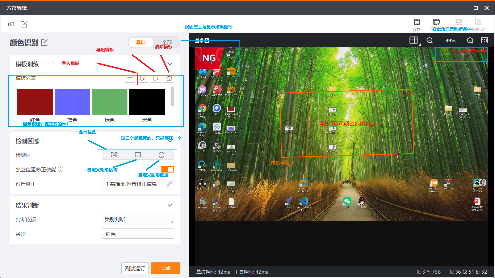
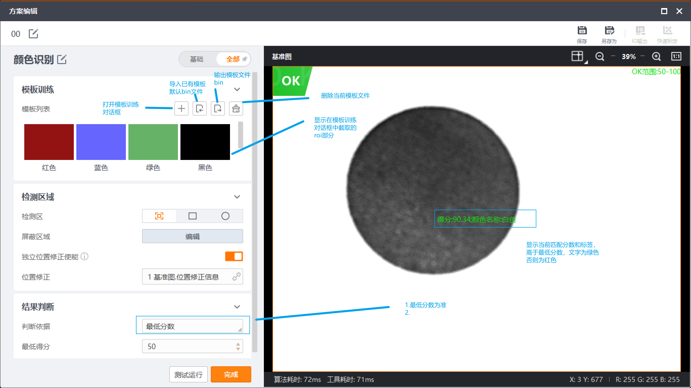
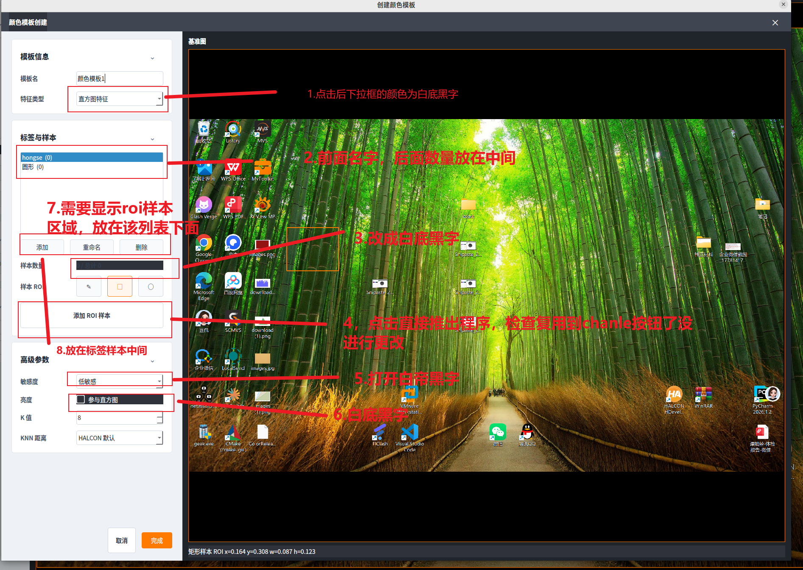
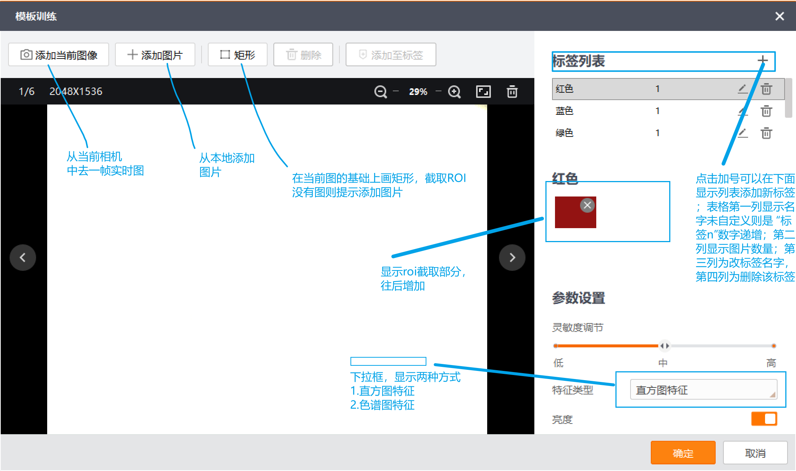

# 颜色识别算子实施计划

## Summary

- 本阶段按计划实施颜色识别 UI、配置语义和 HALCON 直方图识别链路。
- 保留文档中已有图片引用和图片文件。
- 颜色识别第一阶段实现 `直方图特征`；`色谱特征` 只保留接口，暂不实现。

## HALCON 算子强制前置条件

- 后续所有视觉算子的核心算法必须基于 HALCON 已有算子、类或过程实现。
- 任意算子实现前，必须先确认可用 HALCON 算子、类或过程，并在实现计划中列出对应 HALCON 接口。
- 若 HALCON 没有对应能力，或本机 HALCON 24.11 环境缺少所需符号，必须停止实现并向用户确认，不允许自动改用 OpenCV、自写算法或第三方库替代。
- 新增或重做算法 runner 必须采用 HALCON runner 形态，命名和链路参考现有 `OcrHalconRunner`、`PatternPresenceHalconRunner`、`BlobPresenceHalconRunner` 等。
- `qmake`、运行环境、license 和 runtime 路径解析必须继续走现有 `HalconRuntimePaths` 逻辑。
- OpenCV 只允许作为现有工程的图像容器、采集、显示或必要格式桥接使用，不允许作为新算子的核心算法实现。
- 当前工程仍可用 `cv::Mat` 作为 `ToolRequest` 的图像输入载体，但进入算子核心后必须转换为 HALCON 图像并由 HALCON 算子处理。

## 约束

- 实现时只允许做颜色识别算子所需的最小接入，不得重构无关代码。
- 不新增非 HALCON 算法依赖；不得以 OpenCV、自写 KNN 或第三方库替代 HALCON 算子能力。

## UI 方案

 

- 参考用户提供三张截图制定 `颜色识别` 主配置界面。
- UI 控件样式必须参考现有非颜色识别 dlg，重点沿用：
  - `基础 / 全部` 分段按钮。
  - `panelRole=configCard` 配置卡片。
  - `role=cardTitle` 标题、`role=rowField` 行标题、`role=collapseCard` 折叠按钮。
  - `QButtonGroup` 管理的工具组。
  - `actionRole=toolbarIcon` ROI 工具按钮。
  - 右侧预览区工具栏和状态栏节奏。
- 有无工具对话框 UI 基线提取：
  - 整体布局：顶部深色标题栏；主体左右分栏；左侧为浅灰参数面板，右侧为深色图像预览面板；底部保留 `测试运行`、`完成` 等动作按钮。
  - 左侧参数面板：顶部为工具名和 `基础 / 全部` 分段切换；中间使用 `QStackedWidget` 切换基础页和全部页；每页由多个白色配置卡片纵向排列。
  - 配置卡片：统一使用 `panelRole=configCard`；卡片内边距约 18-20px；卡片标题行左侧为 `role=cardTitle`，右侧为 `role=collapseCard` 的折叠按钮；卡片内容使用行式参数布局。
  - 参数行：左侧字段名统一使用 `role=rowField`，保持固定宽度；右侧放置输入控件、工具按钮组或组合框；同组控件横向排列、间距稳定，避免文字撑开布局。
  - 工具组：ROI、结果有无、模式选择等互斥按钮必须用 `QButtonGroup` 管理 checked 状态；图形工具按钮使用 `actionRole=toolbarIcon`，按钮文本优先用图形符号，如 `□`、`○`、`✎`、`⬡`。
  - 右侧预览区：顶部为预览标题和工具栏按钮，如网格、缩放定位、缩小、缩放比例、放大、全屏；中间为图像视图；底部为状态栏，显示 ROI、OK/NG、得分、类别、算法耗时和工具耗时。
  - 按钮风格：主要动作使用橙色高亮；次要动作使用白底灰边；普通管理按钮使用轻量灰边；禁用态必须可见但弱化。
  - 后续精准实现时，以上只作为现有 dlg 风格基线；最终控件位置、宽高、间距、颜色、文案和显隐关系必须结合用户后续提供的截图逐项校准。
- 颜色识别 1:1 复现视觉原则：
  - Visual thesis：工业视觉配置界面应保持克制、清晰、可扫描；左侧为白底深字的参数工作区，右侧为深色图像画布和橙色 ROI/状态强调。
  - Content plan：主 `ColorRecognitionDialog` 先复现三张截图中的 `基础 / 全部` 主界面；`ColorTemplateDialog` 再按用户标注图复现模板创建流程。
  - Interaction thesis：分段切换、卡片折叠、ROI 工具互斥、下拉框展开和样本列表选中态必须稳定，不允许点击按钮导致程序退出或状态错乱。
- 左侧包含：`模板训练`、`检测区域`、`结果判断` 三个配置区。
- 顶部保留 `基础 / 全部` 分段切换。
- 右侧为基准图/当前图像预览区，支持 ROI 显示、OK/NG 状态、预测类别、得分、算法耗时和工具耗时。
- 主界面 `模板训练` 区只保留：
  - 模板列表。
  - 当前模板摘要。
  - `添加模板` / `+` 入口。
  - 删除、重命名、选择当前模板入口。
  - 不在主界面直接编辑标签、ROI 样本或特征类型。
- 点击 `添加模板` / `+` 打开独立 `ColorTemplateDialog` 模板创建对话框。
- `ColorTemplateDialog` 内完成颜色模型配置：
  - 模板名。
  - 标签列表。
  - 添加标签、删除标签、重命名标签。
  - 从当前矩形 ROI 添加样本到选中标签。
  - 显示每个标签的样本数量。
  - `特征类型` 下拉框显示 `直方图特征` 和 `色谱特征` 两种。
  - `直方图特征` 可选并作为默认值；`色谱特征` 可见但置灰不可选。
  - `敏感度`：低敏感、中敏感、高敏感，默认中敏感。
  - `亮度`：直方图特征可开启/关闭。
  - `K 值`：默认 3。
  - `KNN 距离`：仅在确认可映射到 HALCON KNN 参数后启用；无法映射时 UI 禁用并记录为 HALCON 默认策略。
- 主界面 `检测区域` 第一版只支持矩形 ROI；自由区域、圆形区域是否保留以三张主界面截图为准，若截图未出现则不新增。
- `结果判断` 的 `判断依据` 只包含：
  - `最低分数`：显示 `最低得分`，默认 80。
  - `类别判断`：显示 `目标类别`，下拉项来自当前选中模板标签。

## UI 1:1 复现修订计划

### Plan

重新对照三张颜色识别主界面截图和两张模板创建图，先把 `ColorRecognitionDialog` 的 `基础 / 全部` 两个窗口补齐，再把 `ColorTemplateDialog` 按模板图做 1:1 复现。当前已实现的颜色识别 UI 只能作为功能骨架，后续不以当前布局为最终视觉标准。

### Scope
- In: `ColorRecognitionDialog` 主界面基础页、全部页、模板导入导出、屏蔽区域、右侧预览区、`ColorTemplateDialog` 模板创建界面、控件样式、下拉框样式、图像来源、标签/样本列表、ROI 样本区、删除当前 ROI、按钮连接和稳定性验证。
- Out: 不新增色谱特征算法；不改动非颜色识别对话框；不改动 HALCON runner 核心算法，除非 UI 参数字段需要最小适配。

### Action items
[ ] 对照三张主界面截图，补齐 `ColorRecognitionDialog` 的 `基础` 页：模板训练区、检测区域、结果判断、右侧预览工具栏和底部状态栏必须按截图复现，不再只做粗略卡片布局。
[ ] 在 `基础` 页模板训练区增加外部 PC `导入模板` 和 `导出模板` 功能入口，默认文件类型为 `*.bin`；导入/导出针对当前颜色模板数据，不改变 HALCON 核心算法。
[ ] 对照三张主界面截图，补齐 `ColorRecognitionDialog` 的 `全部` 页：`全部` 与 `基础` 的主体布局保持一致，只比 `基础` 多出 `屏蔽区域` 配置；不得把 `全部` 页做成摘要页或空壳。
[ ] 增加 `屏蔽区域` 规划：仅在 `全部` 页出现，用于设置检测时忽略的区域；第一版按截图复现 UI 和保存字段，算法是否真正应用需在 HALCON 算子能力确认后再接入。
[ ] 按两张模板图重做 `ColorTemplateDialog`：窗口标题、深色顶栏、左侧浅灰参数栏、右侧深色基准图画布、橙色图像边框、底部 ROI 状态栏、右下角 `取消 / 完成` 都要按图 1:1 对齐。
[ ] 修正模板信息区控件样式：`特征类型` 下拉框本体和展开列表均为白底黑字，展开项 hover/selected 态清晰；所有 `QComboBox` popup 通过统一样式处理，避免深色底导致不可读。
[ ] 修正标签与样本区列表：标签行显示为 `名称 (数量)`，名称在前、数量紧随其后并保持同一行中部可读；选中态使用蓝色或截图一致色，不挤压文字。
[ ] 在标签与样本区新增 ROI 样本显示区域：该区域位于标签列表下方、样本数量/ROI 工具/添加 ROI 样本按钮附近，用于展示当前标签下已有 ROI 样本列表或缩略信息；样本数量放在标签样本区域中间位置。
[ ] 在 `ColorTemplateDialog` 增加图像来源入口：`添加当前图像` 使用当前相机/基准图作为样本图，`添加图片` 从外部 PC 导入图片；两者都只更新模板创建对话框的样本图像上下文。
[ ] 在 `ColorTemplateDialog` 增加 `删除当前 ROI` 功能：仅当当前标签下选中了某个 ROI 样本时按钮可点击；未选中 ROI 时必须禁用，点击后只删除当前 ROI 样本并刷新样本数量和列表。
[ ] 收敛模板 ROI 工具：`ColorTemplateDialog` 只保留矩形 ROI；自由绘制、圆形、多边形等模板样本 ROI 按钮全部去掉，不再显示暂未接入按钮。
[ ] 修正左侧控件颜色一致性：样本数量、亮度复选框、K 值、KNN 距离、敏感度等输入控件统一白底黑字；禁用态仍可辨识但不使用深色底黑字组合。
[ ] 检查 `添加 ROI 样本` 按钮连接：点击不得关闭模板创建对话框或退出程序；排查是否复用了错误的 channel/handle/accept 连接，确保只执行样本采集和状态刷新。
[ ] 保持 ROI 行为一致：模板样本 ROI 只支持矩形；右侧画布必须显示橙色 ROI overlay 和底部 `矩形样本 ROI x=...` 状态。
[ ] 验证 UI 精准度和稳定性：运行 `qmake qt_ui_test.pro`、`make`；手动检查基础页、全部页、屏蔽区域、模板导入导出、添加模板、添加当前图像、添加图片、删除当前 ROI、下拉框展开、标签新增/重命名/删除、ROI 样本添加、取消/完成、无图像/无样本时不崩溃。

### Open questions
- 后续实现时以两张模板图为 `ColorTemplateDialog` 的最高优先级视觉依据，三张主界面截图作为 `ColorRecognitionDialog` 的最高优先级视觉依据。
- 若截图细节与现有 dlg 基线冲突，优先按截图 1:1 复现，再保留必要的工程通用样式属性。
- 当前阶段只写入规划；等待用户下一步指令后再修改代码和 UI 文件。

## HALCON 算法方案

- 必须新增或重命名为 `ColorRecognitionHalconRunner`，不再以 `ColorRecognitionRunner` 名义保留 OpenCV 核心算法。
- `ColorRecognitionAdapter` 必须持有并调用 `ColorRecognitionHalconRunner`。
- `qt_ui_test.pro` 中颜色识别 runner 条目必须同步改为 `ColorRecognitionHalconRunner.*`。
- 将当前 OpenCV HSV 覆盖率路径废弃，改为 HALCON 颜色识别 runner。
- 第一阶段只实现 `featureType=histogram`。
- `featureType=spectrum` 保留配置和 runner 枚举；运行时返回 `unsupported_feature`，不崩溃。
- HALCON 接口前置清单：
  - 图像桥接：`GenImageInterleaved` 或 `GenImage3`。
  - 通道拆分：`Decompose3`。
  - 色彩空间转换：`TransFromRgb`。
  - ROI 区域：`GenRectangle1` + `ReduceDomain`，或等效 HALCON region/domain 操作。
  - 直方图特征：`GrayHistoRange` 提取 H/S/V 或 H/S 通道直方图并归一化。
  - KNN 分类：`create_class_knn`、`add_sample_class_knn`、`train_class_knn`、`classify_class_knn`。
- HALCON 调用方式：
  - 后续实现优先沿用当前工程已有的 `HalconC.h + dlopen/dlsym` 风格。
  - 不默认引入 `halconcpp` 链接方式；若必须使用 `HClassKnn` C++ wrapper，需先确认链接改动并再次向用户说明。
- 主流程：
  - `cv::Mat` 输入仅作为桥接载体。
  - 归一化输入通道后生成 HALCON RGB 图像。
  - 基于矩形 ROI 生成 HALCON region 并 `ReduceDomain`。
  - 拆分 RGB 通道后用 `TransFromRgb` 转到适合颜色直方图的 HALCON 色彩空间。
  - 通过 `GrayHistoRange` 提取 H/S/V 或 H/S 直方图特征。
  - 将标签样本特征加入 HALCON KNN 分类器并训练。
  - 使用 `classify_class_knn` 输出预测类别和 `Rating`。
  - 根据判断依据输出 OK/NG。
- KNN 参数要求：
  - 实现前必须查 HALCON 24.11 的 KNN 参数名和值域。
  - `K 值` 必须映射到 HALCON KNN 可用参数后才允许生效。
  - `KNN 距离` 若不能映射到 HALCON 参数，UI 禁用该选项，并在 payload 中记录 `knnDistanceApplied="halcon_default"`。
- 得分与 `Rating`：
  - 实现前必须用两类纯色小样本验证 `classify_class_knn` 的 `Rating` 方向和值域。
  - 若 `Rating` 不是“越高越好”的百分制分数，必须明确转换到 0-100 的 `score`，并在 payload 中写入原始 `rating`、转换公式标识和 `scoreDirection`。
- OK/NG 判断：
  - `最低分数`：`score >= minScore` 为 OK，否则 NG。
  - `类别判断`：`predictedLabel == expectedLabel` 为 OK，否则 NG；得分仍输出但不参与 OK/NG。
- 结果输出：
  - `predictedLabel`。
  - `predictedClassId`。
  - `score`。
  - `rating`。
  - `scoreDirection`。
  - `featureType`。
  - `sampleCount`。
  - `roiPixelsRect`。
  - `elapsedMs`。
  - ROI overlay 和状态文本。
- 异常处理：
  - 空图像返回明确错误，不崩溃。
  - 无效 ROI 返回明确错误，不崩溃。
  - 无模型样本返回明确错误，不崩溃。
  - 类别判断但目标类别为空或不存在时返回明确错误，不崩溃。
  - 灰度图输入可桥接为三通道 HALCON 图像后继续运行。
  - HALCON runtime、license、符号或算子不可用时返回明确 HALCON 错误，不允许 fallback 到 OpenCV 核心算法。

## 后续代码接入点记录

- 当前 `ToolType::ColorRecognition`、工具库入口、`ColorRecognitionDialog`、`ColorRecognitionAdapter`、`ColorRecognitionRunner` 和 `qt_ui_test.pro` 条目已存在。
- 后续实现重点不是新增入口，而是重做颜色识别的配置语义和 HALCON runner 逻辑。
- 需要更新 `ColorRecognitionDialog`：
  - 替换目标色和 HSV 容差 UI。
  - 增加模型标签、样本、特征类型、KNN 参数、结果判断模式。
  - 将 `色谱特征` 显示为置灰不可选。
  - 保存和回显新的 `ToolConfig.params` / `judgeRule`。
- 需要更新 `ColorRecognitionAdapter`：
- 从 `ToolConfig.params` / `judgeRule` 解析当前激活模板、颜色模型、特征类型、KNN 参数和判断规则。
  - 解析 `halconSoPath` 并通过 `HalconRuntimePaths::resolveHalconLibPath()` 检查 runtime。
  - 映射 HALCON runner 输出到 `ToolResult`。
- 需要更新颜色识别 runner：
  - 必须新增或重命名为 `ColorRecognitionHalconRunner`。
  - 废弃 OpenCV HSV 覆盖率主路径。
  - 基于 HALCON 图像、直方图和 KNN 分类接口实现直方图特征模式。
  - 保留 `spectrum` 接口并返回 `unsupported_feature`。

## 配置字段建议

- `params.colorModel.activeTemplateId`: 当前选中模板 id。
- `params.colorModel.templates`: 模板列表。
- `params.colorModel.templates[].templateId`: 稳定模板 id。
- `params.colorModel.templates[].name`: 模板名。
- `params.colorModel.templates[].featureType`: `histogram` 或 `spectrum`。
- `params.colorModel.templates[].sensitivity`: `low`、`medium` 或 `high`。
- `params.colorModel.templates[].brightnessEnabled`: 布尔值。
- `params.colorModel.templates[].knnK`: 正整数，默认 3。
- `params.colorModel.templates[].knnDistance`: 保留字段；第一版按 HALCON KNN 可用能力映射，无法映射时记录为 HALCON 默认策略。
- `params.colorModel.templates[].labels`: 标签列表，每个标签包含名称和稳定 class id。
- `params.colorModel.templates[].samples`: 样本列表，每个样本包含 `label`、`classId`、`feature`、`roiNormalized`。
- `params.featureType`、`params.sensitivity`、`params.brightnessEnabled`、`params.knnK` 保留为当前激活模板的冗余摘要，便于 Adapter 兼容读取。
- `params.halconSoPath`: 可选 HALCON runtime 显式路径。
- `judgeRule.mode`: `min_score` 或 `category`。
- `judgeRule.minScore`: 最低得分，0-100。
- `judgeRule.expectedLabel`: 类别判断目标类别，来自当前选中模板标签。

## Test Plan

### 文档阶段

- 确认截图引用仍存在，截图文件未删除。
- 确认文档明确主界面模板训练区只保留模板列表/添加模板入口。
- 确认文档明确 `ColorTemplateDialog` 负责标签、ROI 样本、特征类型等配置。
- 确认文档明确写入 HALCON 算子强制前置条件。
- 确认文档不再把 OpenCV 作为颜色识别核心算法。
- 确认文档明确要求 `ColorRecognitionHalconRunner` 命名。
- 确认文档明确记录 `直方图特征` 第一阶段实现、`色谱特征` 仅预留接口。

### 后续实现阶段

- `qmake qt_ui_test.pro` 通过。
- `make` 编译通过。
- 启动时能解析 HALCON runtime 和 license。
- HALCON runtime、license 或必要符号缺失时返回明确错误。
- 工具库能看到 `颜色识别`。
- 能新建、保存、编辑颜色识别工具。
- 主界面模板训练区只显示模板列表、当前模板摘要和添加/删除/重命名入口。
- 点击 `添加模板` / `+` 打开 `ColorTemplateDialog`。
- 能在 `ColorTemplateDialog` 创建标签、删除标签、重命名标签。
- 能在 `ColorTemplateDialog` 从矩形 ROI 添加样本，并在重新打开配置时回显样本数量。
- 能选择 `直方图特征`；`色谱特征` 显示但不可选。
- 能设置 `敏感度`、`亮度`、`K 值`。
- `classify_class_knn` 的 `Rating` 方向和值域已用两类纯色小样本验证。
- `最低分数` 判断能根据得分输出 OK/NG。、
- `类别判断` 能根据预测类别输出 OK/NG。
- 单次运行能输出预测类别、得分、OK/NG、ROI overlay、算法耗时和工具耗时。
- 空图像、无效 ROI、无模型样本、灰度图输入时不崩溃。
- 已有 OCR、图案有无、Blob、圆、边、线、轮廓等 HALCON runner 链路不受影响。

## Assumptions

- 本轮按用户确认执行代码实现。
- 实现时可最小化修改必要接入点，但不得改动无关现有算子行为。
- 第一版模型只保存特征向量、标签和 class id，不保存训练图片，避免方案 JSON 过大。
- 自由 ROI、圆形 ROI、模型导入导出先不接入；如需完整模型管理，后续单独扩展。
