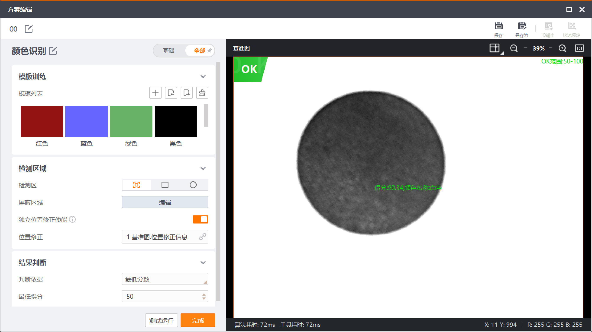

# 颜色识别算子实施计划

## Summary

- 本阶段只更新 `AGENTS.md` 规划文档，不修改现有源码、UI 文件、工程文件或算法代码。
- 保留文档中已有图片引用和图片文件。
- 颜色识别第一阶段实现 `直方图特征`；`色谱特征` 只保留接口，暂不实现。
- 后续真正实现颜色识别算子前，必须再次获得用户确认。

## HALCON 算子强制前置条件

- 后续所有视觉算子的核心算法必须基于 HALCON 已有算子、类或过程实现。
- 任意算子实现前，必须先确认可用 HALCON 算子、类或过程，并在实现计划中列出对应 HALCON 接口。
- 若 HALCON 没有对应能力，或本机 HALCON 24.11 环境缺少所需符号，必须停止实现并向用户确认，不允许自动改用 OpenCV、自写算法或第三方库替代。
- 新增或重做算法 runner 必须采用 HALCON runner 形态，命名和链路参考现有 `OcrHalconRunner`、`PatternPresenceHalconRunner`、`BlobPresenceHalconRunner` 等。
- `qmake`、运行环境、license 和 runtime 路径解析必须继续走现有 `HalconRuntimePaths` 逻辑。
- OpenCV 只允许作为现有工程的图像容器、采集、显示或必要格式桥接使用，不允许作为新算子的核心算法实现。
- 当前工程仍可用 `cv::Mat` 作为 `ToolRequest` 的图像输入载体，但进入算子核心后必须转换为 HALCON 图像并由 HALCON 算子处理。

## 约束

- 当前阶段不得修改现有代码。
- 后续实现前必须再次获得用户确认。
- 实现时只允许做颜色识别算子所需的最小接入，不得重构无关代码。
- 不新增非 HALCON 算法依赖；不得以 OpenCV、自写 KNN 或第三方库替代 HALCON 算子能力。

## UI 方案

 
 

- 参考用户提供截图，新增 `颜色识别` 配置界面。
- 左侧包含：`模板训练`、`检测区域`、`结果判断` 三个配置区。
- 顶部保留 `基础 / 全部` 分段切换。
- 右侧为基准图/当前图像预览区，支持 ROI 显示、OK/NG 状态、预测类别、得分、算法耗时和工具耗时。
- `模板训练` 改为颜色模型配置：
  - 模型名。
  - 标签列表。
  - 添加标签、删除标签、重命名标签。
  - 从当前矩形 ROI 添加样本到选中标签。
  - 显示每个标签的样本数量。
  - `特征类型` 下拉框显示 `直方图特征` 和 `色谱特征` 两种。
  - `直方图特征` 可选并作为默认值；`色谱特征` 可见但置灰不可选。
- `全部` 参数页增加：
  - `敏感度`：低敏感、中敏感、高敏感，默认中敏感。
  - `亮度`：直方图特征可开启/关闭。
  - `K 值`：默认 3。
  - `KNN 距离`：仅在确认可映射到 HALCON KNN 参数后启用；无法映射时 UI 禁用并记录为 HALCON 默认策略。
- `检测区域` 第一版只支持矩形 ROI；自由区域、圆形区域保留按钮并提示暂未接入。
- `结果判断` 的 `判断依据` 只包含：
  - `最低分数`：显示 `最低得分`，默认 80。
  - `类别判断`：显示 `目标类别`，下拉项来自模板标签。

## HALCON 算法方案

- 必须新增或重命名为 `ColorRecognitionHalconRunner`，不再以 `ColorRecognitionRunner` 名义保留 OpenCV 核心算法。
- `ColorRecognitionAdapter` 必须持有并调用 `ColorRecognitionHalconRunner`。
- `qt_ui_test.pro` 中颜色识别 runner 条目必须同步改为 `ColorRecognitionHalconRunner.*`。
- 将当前 OpenCV HSV 覆盖率路径废弃，改为 HALCON 颜色识别 runner。
- 第一阶段只实现 `featureType=histogram`。
- `featureType=spectrum` 保留配置和 runner 枚举；运行时返回 `unsupported_feature`，不崩溃。
- HALCON 接口前置清单：
  - 图像桥接：`GenImageInterleaved` 或 `GenImage3`。
  - 通道拆分：`Decompose3`。
  - 色彩空间转换：`TransFromRgb`。
  - ROI 区域：`GenRectangle1` + `ReduceDomain`，或等效 HALCON region/domain 操作。
  - 直方图特征：`GrayHistoRange` 提取 H/S/V 或 H/S 通道直方图并归一化。
  - KNN 分类：`create_class_knn`、`add_sample_class_knn`、`train_class_knn`、`classify_class_knn`。
- HALCON 调用方式：
  - 后续实现优先沿用当前工程已有的 `HalconC.h + dlopen/dlsym` 风格。
  - 不默认引入 `halconcpp` 链接方式；若必须使用 `HClassKnn` C++ wrapper，需先确认链接改动并再次向用户说明。
- 主流程：
  - `cv::Mat` 输入仅作为桥接载体。
  - 归一化输入通道后生成 HALCON RGB 图像。
  - 基于矩形 ROI 生成 HALCON region 并 `ReduceDomain`。
  - 拆分 RGB 通道后用 `TransFromRgb` 转到适合颜色直方图的 HALCON 色彩空间。
  - 通过 `GrayHistoRange` 提取 H/S/V 或 H/S 直方图特征。
  - 将标签样本特征加入 HALCON KNN 分类器并训练。
  - 使用 `classify_class_knn` 输出预测类别和 `Rating`。
  - 根据判断依据输出 OK/NG。
- KNN 参数要求：
  - 实现前必须查 HALCON 24.11 的 KNN 参数名和值域。
  - `K 值` 必须映射到 HALCON KNN 可用参数后才允许生效。
  - `KNN 距离` 若不能映射到 HALCON 参数，UI 禁用该选项，并在 payload 中记录 `knnDistanceApplied="halcon_default"`。
- 得分与 `Rating`：
  - 实现前必须用两类纯色小样本验证 `classify_class_knn` 的 `Rating` 方向和值域。
  - 若 `Rating` 不是“越高越好”的百分制分数，必须明确转换到 0-100 的 `score`，并在 payload 中写入原始 `rating`、转换公式标识和 `scoreDirection`。
- OK/NG 判断：
  - `最低分数`：`score >= minScore` 为 OK，否则 NG。
  - `类别判断`：`predictedLabel == expectedLabel` 为 OK，否则 NG；得分仍输出但不参与 OK/NG。
- 结果输出：
  - `predictedLabel`。
  - `predictedClassId`。
  - `score`。
  - `rating`。
  - `scoreDirection`。
  - `featureType`。
  - `sampleCount`。
  - `roiPixelsRect`。
  - `elapsedMs`。
  - ROI overlay 和状态文本。
- 异常处理：
  - 空图像返回明确错误，不崩溃。
  - 无效 ROI 返回明确错误，不崩溃。
  - 无模型样本返回明确错误，不崩溃。
  - 类别判断但目标类别为空或不存在时返回明确错误，不崩溃。
  - 灰度图输入可桥接为三通道 HALCON 图像后继续运行。
  - HALCON runtime、license、符号或算子不可用时返回明确 HALCON 错误，不允许 fallback 到 OpenCV 核心算法。

## 后续代码接入点记录

- 当前 `ToolType::ColorRecognition`、工具库入口、`ColorRecognitionDialog`、`ColorRecognitionAdapter`、`ColorRecognitionRunner` 和 `qt_ui_test.pro` 条目已存在。
- 后续实现重点不是新增入口，而是重做颜色识别的配置语义和 HALCON runner 逻辑。
- 需要更新 `ColorRecognitionDialog`：
  - 替换目标色和 HSV 容差 UI。
  - 增加模型标签、样本、特征类型、KNN 参数、结果判断模式。
  - 将 `色谱特征` 显示为置灰不可选。
  - 保存和回显新的 `ToolConfig.params` / `judgeRule`。
- 需要更新 `ColorRecognitionAdapter`：
  - 从 `ToolConfig.params` / `judgeRule` 解析颜色模型、特征类型、KNN 参数和判断规则。
  - 解析 `halconSoPath` 并通过 `HalconRuntimePaths::resolveHalconLibPath()` 检查 runtime。
  - 映射 HALCON runner 输出到 `ToolResult`。
- 需要更新颜色识别 runner：
  - 必须新增或重命名为 `ColorRecognitionHalconRunner`。
  - 废弃 OpenCV HSV 覆盖率主路径。
  - 基于 HALCON 图像、直方图和 KNN 分类接口实现直方图特征模式。
  - 保留 `spectrum` 接口并返回 `unsupported_feature`。

## 配置字段建议

- `params.featureType`: `histogram` 或 `spectrum`。
- `params.sensitivity`: `low`、`medium` 或 `high`。
- `params.brightnessEnabled`: 布尔值。
- `params.knnK`: 正整数，默认 3。
- `params.knnDistance`: 保留字段；第一版按 HALCON KNN 可用能力映射，无法映射时记录为 HALCON 默认策略。
- `params.colorModel.labels`: 标签列表，每个标签包含名称和稳定 class id。
- `params.colorModel.samples`: 样本列表，每个样本包含 `label`、`classId`、`feature`、`roiNormalized`。
- `params.halconSoPath`: 可选 HALCON runtime 显式路径。
- `judgeRule.mode`: `min_score` 或 `category`。
- `judgeRule.minScore`: 最低得分，0-100。
- `judgeRule.expectedLabel`: 类别判断目标类别。

## Test Plan

### 文档阶段

- 确认本次只修改 `AGENTS.md`。
- 确认截图引用仍存在，截图文件未删除。
- 确认文档明确写入 HALCON 算子强制前置条件。
- 确认文档不再把 OpenCV 作为颜色识别核心算法。
- 确认文档明确要求 `ColorRecognitionHalconRunner` 命名。
- 确认文档明确记录 `直方图特征` 第一阶段实现、`色谱特征` 仅预留接口。

### 后续实现阶段

- `qmake qt_ui_test.pro` 通过。
- `make` 编译通过。
- 启动时能解析 HALCON runtime 和 license。
- HALCON runtime、license 或必要符号缺失时返回明确错误。
- 工具库能看到 `颜色识别`。
- 能新建、保存、编辑颜色识别工具。
- 能创建标签、删除标签、重命名标签。
- 能从矩形 ROI 添加样本，并在重新打开配置时回显样本数量。
- 能选择 `直方图特征`；`色谱特征` 显示但不可选。
- 能设置 `敏感度`、`亮度`、`K 值`。
- `classify_class_knn` 的 `Rating` 方向和值域已用两类纯色小样本验证。
- `最低分数` 判断能根据得分输出 OK/NG。、
- `类别判断` 能根据预测类别输出 OK/NG。
- 单次运行能输出预测类别、得分、OK/NG、ROI overlay、算法耗时和工具耗时。
- 空图像、无效 ROI、无模型样本、灰度图输入时不崩溃。
- 已有 OCR、图案有无、Blob、圆、边、线、轮廓等 HALCON runner 链路不受影响。

## Assumptions

- 当前阶段只写计划文档。
- 真正实现颜色识别算子需要后续单独确认。
- 后续实现时可最小化修改必要接入点，但不得改动无关现有算子行为。
- 第一版模型只保存特征向量、标签和 class id，不保存训练图片，避免方案 JSON 过大。
- 自由 ROI、圆形 ROI、模型导入导出先不接入；如需完整模型管理，后续单独扩展。
