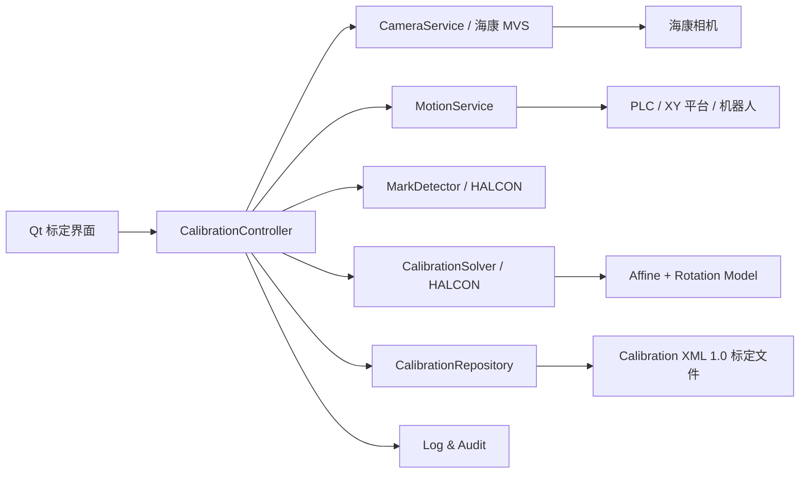
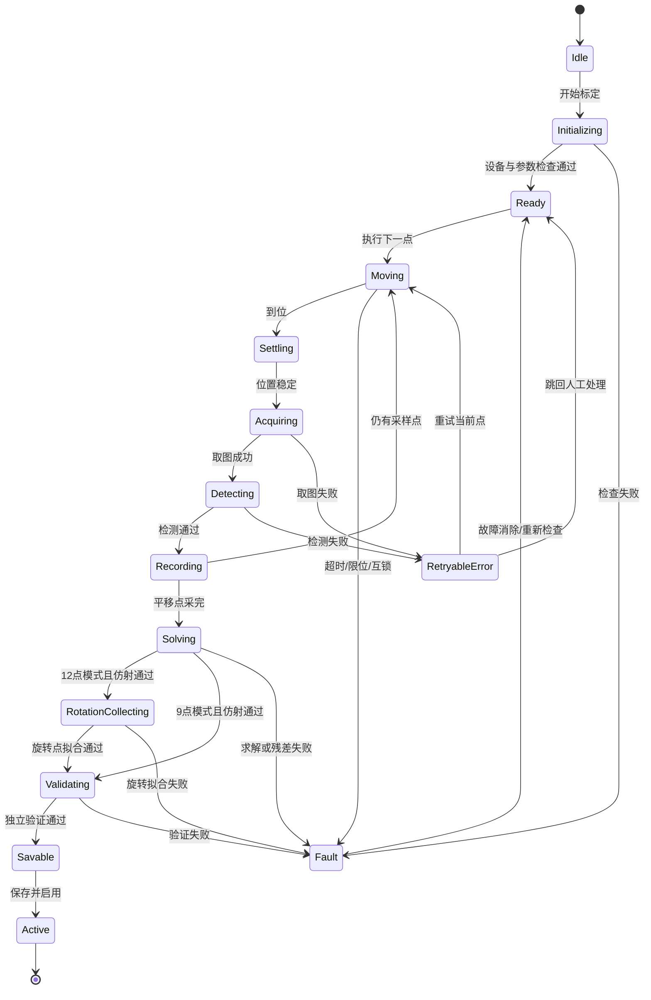
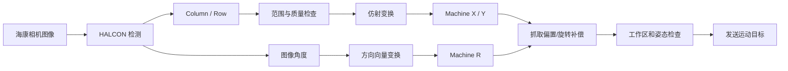

# N点标定功能实施文档

**适用技术栈：** Qt + 海康相机 SDK（MVS）+ HALCON + 机械臂/XY 运动控制  
**文档性质：** 软件设计、开发、联调、测试与验收依据  
**版本：** V1.0  
**日期：** 2026-08-03

---

## 1. 文档目的

本文档定义固定相机视觉定位系统中的 N 点标定功能，覆盖从标定治具、点位规划、图像采集、运动控制、HALCON 求解、误差验证、结果持久化，到生产运行时坐标转换的完整软件实施方案。

本文档面向以下角色：

- Qt/C++ 软件开发人员；
- HALCON 视觉算法开发人员；
- 海康相机 SDK 集成人员；
- 机械臂、XY 平台或运动控制开发人员；
- 设备调试、测试、工艺与验收人员。

> **核心结论：** 固定相机模式下，通常由机械臂或 XY 平台带动一个固定标记点移动 9 次，每次采集一组“图像像素坐标 ↔ 机械坐标”。九宫格由机械坐标规划保证，不要求 9 个标记点在图像中排成标准九宫格。图像坐标统一使用 `Column/Row`，机械坐标统一使用 `X/Y`。

---

## 2. 项目背景与目标

### 2.1 项目背景

生产视觉定位需要将相机检测到的图像位置转换为机械臂或运动平台可执行的机械位置。相机输出的是像素坐标，运动系统执行的是毫米坐标，两者存在平移、旋转、缩放、轴向翻转、安装偏角，以及一定程度的成像畸变。软件必须通过标定建立稳定、可追溯的坐标映射关系。

本项目采用固定相机方案：相机与镜头在标定和生产期间保持不动，机械臂、XY 平台或随动治具带动同一个标记特征移动，以获取多组对应数据。对平面定位场景，使用二维仿射模型建立像素坐标到机械坐标的映射；如需补偿末端旋转带来的偏心运动，再采集额外旋转点并拟合旋转中心。

### 2.2 建设目标

软件应实现以下目标：

1. 提供引导式 9 点/12 点标定操作；
2. 联动海康相机、HALCON 视觉检测和运动控制；
3. 自动规划机械坐标九宫格并逐点采集；
4. 计算像素 `Column/Row` 到机械 `X/Y` 的二维仿射变换；
5. 在 12 点模式下，利用后 3 个旋转采样点拟合旋转中心；
6. 自动计算拟合残差，并使用独立验证点判断标定是否可投入生产；
7. 对标定结果进行版本化、持久化、审计和安全加载；
8. 在生产流程中提供线程安全、低耦合的坐标转换接口；
9. 对设备异常、运动越界、检测失败和配置不一致进行拦截。

### 2.3 非目标

本功能不直接替代以下能力：

- 相机内参和镜头畸变标定；
- 三维手眼标定或机器人六自由度标定；
- 相机移动的 Eye-in-Hand 标定；
- Z 高度变化明显时的三维坐标恢复；
- 机械臂本体精度、TCP、工具坐标系和工件坐标系标定。

---

## 3. 适用范围与前提

### 3.1 适用场景

- 相机固定在设备机架上；
- 工件或标定治具在近似平面内运动；
- 机械运动以 `X/Y` 为主要定位自由度；
- 标定高度与生产检测高度一致或高度差可忽略；
- 目标区域可由一个二维仿射模型覆盖；
- 机械臂或 XY 平台能返回稳定、可信的实际位置。

### 3.2 必要前提

标定前必须满足：

- 相机、镜头、光源、安装支架已锁紧；
- 相机分辨率、ROI、像素格式、触发模式与生产配置一致；
- 曝光、增益、光源亮度已固定或受配方管理；
- 镜头畸变已足够小，或图像已统一经过畸变校正；
- 机械坐标系、工具坐标系和工件坐标系定义明确；
- 标定点与生产对象处于同一工作平面；
- 运动系统已回零，软限位和安全互锁有效；
- 标定区域覆盖实际生产定位区域，而非只集中在画面中心；
- 所有样本必须使用同一种像素空间：全部为原始像素，或全部为校正后像素，禁止混用。

### 3.3 模型适用性判断

二维仿射模型为：

```text
X = a·Column + b·Row + c
Y = d·Column + e·Row + f
```

该模型能表达平移、旋转、非等比例缩放、剪切和轴方向翻转。当独立验证点在视野边缘出现系统性误差时，应优先检查：

1. 镜头畸变是否未校正；
2. 标定平面与生产平面是否高度不一致；
3. 相机光轴是否倾斜过大，是否应使用透视模型；
4. 机械坐标回读是否与图像采集时刻不一致；
5. 标记检测是否存在随位置变化的偏差。

不得仅通过放宽验收阈值掩盖模型不适用问题。

---

## 4. 术语、坐标与方向约定

| 术语 | 定义 |
|---|---|
| `Column` | 图像列坐标，通常向右增大，等价于图像 x |
| `Row` | 图像行坐标，通常向下增大，等价于图像 y |
| `X/Y` | 机械坐标，单位通常为 mm，方向由设备坐标系定义 |
| 标记点 | 固定在随动治具、平台或机器人末端上的唯一可检测特征 |
| 9 点标定 | 采集 9 组平移位置的像素点和机械点，求二维仿射关系 |
| 12 点标定 | 9 点平移标定 + 3 个旋转角度采样，用于拟合旋转中心 |
| 拟合残差 | 标定样本经模型转换后的预测机械坐标与实际机械坐标之差 |
| 独立验证点 | 不参与模型求解、仅用于评价真实泛化误差的点 |

### 4.1 强制命名规则

- 图像坐标字段使用 `column`、`row`，不得写成含义不明的 `x`、`y`；
- 机械坐标字段使用 `machineX`、`machineY`；
- HALCON 点变换输入顺序统一为 `Column, Row`；
- UI 表格列名明确显示单位：`Column(px)`、`Row(px)`、`X(mm)`、`Y(mm)`；
- 所有角度持久化时同时记录单位，默认使用 degree；内部计算可统一转换为 radian。

### 4.2 坐标方向说明

图像 `Row` 通常向下增大，而机械 `Y` 可能向上、向下或与图像方向相反。相机还可能绕光轴旋转安装。因此，图像中的 9 个点可能呈倾斜、镜像或非正方形分布，这并不等于标定错误。轴向关系应由仿射矩阵自动求出，不应在采集阶段人为交换行列或强行翻转坐标。

---

## 5. 9 点与 12 点定义

### 5.1 9 点标定

9 点标定是指运动系统携带同一个固定标记点，依次移动到 9 个机械目标位置。每次停止稳定后拍摄一张或多张图像，检测同一标记点的像素中心，并读取对应的机械实际位置。

每个样本定义为：

```text
(Column_i, Row_i) ↔ (X_i, Y_i), i = 1...9
```

典型机械九宫格由中心点和 X/Y 间距生成：

```text
(Xc-dx, Yc-dy)  (Xc, Yc-dy)  (Xc+dx, Yc-dy)
(Xc-dx, Yc)     (Xc, Yc)     (Xc+dx, Yc)
(Xc-dx, Yc+dy)  (Xc, Yc+dy)  (Xc+dx, Yc+dy)
```

推荐采用蛇形路径以减少空行程：

```text
1 → 2 → 3
        ↓
6 ← 5 ← 4
↓
7 → 8 → 9
```

九宫格“标准”是指机械目标点规划明确、间距可追溯，并非图像像素点必须构成水平、垂直、等间距的正方形。

### 5.2 12 点标定

12 点标定由两部分组成：

- 前 9 点：改变机械 `X/Y`，求像素到机械坐标的仿射矩阵；
- 后 3 点：机械 `X/Y` 基本保持不变，仅改变旋转轴角度，采集同一偏心标记点的轨迹，用于拟合旋转中心。

建议旋转采样角度覆盖足够弧度，例如 `-30°、0°、+30°` 或 `-45°、0°、+45°`。三个角度是数学最小数量，对噪声较敏感；若工期和节拍允许，工程上建议扩展为 5～9 个旋转点并使用最小二乘圆拟合。

> **重要限制：** 后 3 点采集时，标记点不能恰好位于旋转轴中心。若标记与旋转中心重合，旋转后像素位置几乎不变，无法拟合圆和旋转中心。应使用具有已知或稳定偏心量的标记点。

---

## 6. 标定治具与单标记点设计

### 6.1 推荐结构

标定治具可为一块小型刚性板，只需包含一个稳定、易检测的特征：

```text
┌────────────────┐
│                │
│       ●        │  ← 唯一标记点
│                │
└────────────────┘
```

治具可采用以下安装方式：

- 固定在 XY 平台上；
- 固定在机器人末端工具上；
- 由夹爪重复定位夹持；
- 安装在随工装移动的基准件上。

### 6.2 标记形式

可选形式包括：

- 高对比圆点或圆孔；
- 同心圆；
- 十字中心；
- HALCON 形状模板特征；
- 工具上的稳定几何中心。

优先推荐高对比实心圆、圆孔或同心圆。圆形中心对旋转不敏感，便于做亚像素拟合。

### 6.3 设计要求

- 治具刚性足够，运动和旋转过程中不得发生相对滑动；
- 标记尺寸在全视野内均可稳定成像，建议直径不少于 10～20 像素；
- 标记与背景具有足够灰度对比；
- 反光材质应配合漫射光或偏振方案；
- 标记中心提取重复性应优于最终定位精度要求；
- 治具高度应与生产目标平面一致；
- 旋转中心标定时，偏心半径应足够大以形成可拟合圆弧，但不得导致标记旋转后超出视野。

### 6.4 不推荐方式

- 手持标定板移动，无法保证机械位置对应关系；
- 每次更换不同标记点，造成特征中心定义不一致；
- 标定时自动曝光而生产时固定曝光；
- 使用松动、柔性或吸附不稳定的治具；
- 标定平面与生产平面存在明显 Z 高度差。

---

## 7. 系统架构与模块职责

### 7.1 总体架构



### 7.2 模块职责

| 模块 | 主要职责 |
|---|---|
| `CalibrationPage` | 参数输入、点位表格、图像显示、进度、残差和结果展示 |
| `CalibrationController` | 状态机、任务编排、超时、取消、重试和线程协调 |
| `CameraService` | 相机连接、配置核对、软/硬触发、取图、帧时间戳和缓冲区管理 |
| `MotionService` | 回零状态、点位移动、实际位置回读、到位判定、软限位和急停状态 |
| `MarkDetector` | ROI 管理、标记检测、亚像素中心、质量评分和诊断图形 |
| `CalibrationSolver` | 仿射求解、旋转中心拟合、残差、离群点和模型有效性判断 |
| `CalibrationRepository` | Calibration XML 1.0 序列化、原子写入、版本、备份、校验和与加载 |
| `RuntimeTransformService` | 生产过程中的坐标转换、方向转换和模型状态检查 |
| `AuditLogger` | 操作审计、设备事件、样本数据、错误码和性能日志 |
| `SafetyInterlock` | 急停、防护门、伺服、回零、限位和用户权限检查 |

### 7.3 线程模型

- Qt UI 线程只负责显示和用户交互，不执行阻塞取图、运动等待或 HALCON 重计算；
- 相机回调线程只复制或引用计数管理图像缓冲区，不在回调中执行耗时算法；
- 标定任务运行在工作线程，通过 signal/slot 向 UI 汇报状态；
- 运动命令必须支持超时和取消；取消不等于急停，急停由安全控制链独立处理；
- 标定模型加载后以不可变对象提供给生产线程，更新时采用原子替换；
- 所有跨线程对象明确所有权，禁止相机 SDK 缓冲区释放后继续被 HALCON 使用。

---

## 8. Qt 界面设计

### 8.1 页面布局

建议将“标定管理”作为工程师权限页面，分为以下区域：

1. **设备状态区**
   - 相机连接、取流、触发模式；
   - 运动控制连接、回零、伺服、急停、防护门；
   - 当前机械 `X/Y/R`；
   - 当前配方、相机序列号和标定状态。

2. **标定参数区**
   - 模式：9 点 / 12 点；
   - 中心机械坐标 `Xc/Yc`；
   - X/Y 间距 `dx/dy`；
   - Z、安全高度、运动速度、加速度；
   - 到位容差、稳定等待时间；
   - 旋转角度列表；
   - 曝光、增益、触发方式、检测配方；
   - 误差阈值。

3. **图像显示区**
   - 实时图像或当前采集帧；
   - 标记轮廓、中心十字、ROI；
   - 当前 `Column/Row`；
   - 检测分数、面积、圆度等质量信息。

4. **采样点表格**

| 序号 | 类型 | 目标 X/Y/R | 实际 X/Y/R | Column/Row | 质量 | 残差 | 状态 |
|---:|---|---|---|---|---:|---:|---|
| 1～9 | 平移 | 自动生成 | 到位回读 | 检测结果 | 分数 | 求解后显示 | 待采/通过/失败 |
| 10～12 | 旋转 | X/Y 固定、R 变化 | 到位回读 | 检测结果 | 分数 | 圆拟合后显示 | 待采/通过/失败 |

5. **操作区**
   - 连接检查；
   - 生成点位；
   - 单步移动；
   - 单点采集/重采；
   - 自动采集；
   - 暂停/继续；
   - 安全取消；
   - 求解；
   - 独立验证；
   - 保存并启用；
   - 导出报告。

6. **结果区**
   - 仿射矩阵；
   - 平均误差、RMSE、最大误差；
   - 独立验证结果；
   - 旋转中心和拟合半径；
   - 标定 ID、版本、操作员和时间；
   - “未标定/已求解未验证/验证通过/已启用/已失效”状态。

### 8.2 交互约束

- “保存并启用”仅在求解成功且独立验证通过后可用；
- 自动采集期间禁止编辑点位规划参数；
- 单点重采后必须重新求解和验证；
- 对即将发生的机械运动显示目标点，并检查安全区域；
- 手动移动和自动采集需明确区分；
- 关闭页面不得强制销毁正在运行的运动任务，应先请求安全取消；
- 相机配置、分辨率、ROI 或坐标空间变化后，当前标定自动标记为不匹配。

---

## 9. 标定状态机

### 9.1 主状态



### 9.2 状态数据要求

每次状态迁移至少记录：

- 前状态、后状态；
- 标定会话 ID；
- 当前点号；
- 触发事件；
- 时间戳；
- 操作员或自动动作；
- 错误码与上下文。

### 9.3 暂停与取消

- 暂停只在当前原子操作完成后生效，例如等待当前运动停止或当前帧处理结束；
- 取消后停止派发新运动，并请求运动系统减速停止；
- 急停由硬件安全链执行，软件只读取并显示状态；
- 被取消的会话保留日志，但不得保存为有效标定。

---

## 10. 9 点采集详细流程

### 10.1 标定前检查

软件依次检查：

1. 用户具有标定权限；
2. 相机在线，序列号与配方一致；
3. 分辨率、ROI、像素格式、触发模式、曝光和增益符合配置；
4. 运动控制在线、已回零、伺服开启；
5. 急停释放、防护门策略满足设备要求；
6. 当前工具坐标系、工件坐标系和标定配置一致；
7. 所有规划点在软限位及标定安全区域内；
8. 标记在预览图像中可检测；
9. 存储路径可写，系统时间有效；
10. 当前标定平面、治具和光学配置已由操作员确认。

### 10.2 生成机械九宫格

输入中心 `(Xc, Yc)` 和间距 `(dx, dy)`，生成 9 个目标点。点位间距应兼顾覆盖率和安全性：

- 建议覆盖有效生产视野的 60%～80%；
- 四角点尽量接近但不得超出生产有效区；
- 标记完整轮廓必须保留在 ROI 内；
- X/Y 间距不必相等；
- 点位不得共线；
- 规划后先进行纯软件限位检查，再允许运动。

### 10.3 单点采集时序

每个平移点按以下顺序执行：

1. **下发运动**：向 `MotionService` 发送目标 `X/Y`，必要时包含安全 Z 和固定 R；
2. **等待到位**：同时满足控制器 `inPosition=true`、位置误差小于容差、速度小于阈值；
3. **稳定等待**：等待机械振动和曝光环境稳定，例如 100～500 ms，具体由设备调试确定；
4. **读取实际位置**：读取稳定后的实际 `X/Y/R`，不得只记录目标位置；
5. **触发相机**：使用与生产一致的触发方式采图；
6. **关联数据**：记录帧号、相机时间戳、主机时间戳和机械位置采样时间；
7. **检测标记**：HALCON 输出 `Column/Row`、分数及轮廓质量；
8. **重复性检查**：可连续采 3～5 帧，使用中位数作为坐标，并计算像素抖动；
9. **质量判定**：检测分数、面积、圆度、位置范围和帧间标准差均通过；
10. **记录样本**：保存实际机械位置、像素中心、质量数据和诊断信息；
11. **进入下一点**：采用蛇形路径继续采集。

### 10.4 标记检测建议

圆形标记可采用以下 HALCON 流程：

```text
灰度/对比度预处理
→ threshold 或 dyn_threshold
→ connection
→ select_shape（面积、圆度、尺寸）
→ 边缘或区域中心提取
→ 亚像素圆拟合
→ 输出 CenterRow / CenterColumn
```

模板标记可使用形状模板匹配，输出匹配中心及角度。无论采用何种方法，接口输出必须显式转换为：

```text
PixelPoint { column, row }
```

### 10.5 点位与图像帧关联

为避免“上一点图像对应下一点机械位置”，必须建立严格关联：

- 每次移动生成唯一 `moveId`；
- 到位后生成唯一 `captureRequestId`；
- 相机帧记录 `frameId` 和触发序号；
- 样本同时保存 `moveId/captureRequestId/frameId`；
- 若触发序号不连续、帧过期或时间差超限，样本作废并重采；
- 不允许使用界面当前坐标代替采样时刻的机械回读值。

### 10.6 采集完成检查

9 点全部采完后，求解前检查：

- 样本数等于 9；
- 点号唯一且对应顺序正确；
- 像素坐标无重复或近似重合；
- 机械点覆盖面积满足阈值；
- 像素点覆盖面积满足阈值；
- 检测质量均通过；
- 机械位置回读与目标位置差异在允许范围内；
- 相机配置在采集期间未变化。

---

## 11. 后 3 点旋转采集流程

### 11.1 前置条件

- 前 9 点仿射模型已求解并通过残差检查；
- 旋转轴、角度单位和正方向明确；
- 标记点相对旋转轴存在稳定偏心；
- 旋转路径不会碰撞，标记始终处于视野内；
- 旋转过程中用于标定的机械 `X/Y` 保持不变或变化量可被准确记录。

### 11.2 旋转点规划

选择一个安全的机械中心位置 `(Xr, Yr)`，保持 X/Y 指令不变，依次下发 3 个旋转角，例如：

```text
Point 10: X=Xr, Y=Yr, R=-30°
Point 11: X=Xr, Y=Yr, R=  0°
Point 12: X=Xr, Y=Yr, R=+30°
```

角度跨度过小会放大拟合误差。应在机械安全和视野范围允许的前提下扩大角度覆盖。三个点不得在像素空间近似共线。

### 11.3 采集步骤

每个旋转点执行：

1. 移动至旋转标定中心位置；
2. 下发目标角度；
3. 等待 X/Y/R 到位并稳定；
4. 回读实际 `X/Y/R`；
5. 触发取图；
6. 检测同一标记点的 `Column/Row`；
7. 记录检测质量和时间关联信息；
8. 检查相邻角度的标记位移是否显著大于检测噪声；
9. 三点完成后执行圆拟合。

### 11.4 失败条件

- 三个像素点近似共线；
- 拟合半径过小，接近像素检测抖动；
- 圆拟合残差超过阈值；
- X/Y 实际位置变化超过允许值；
- 角度回读与目标差异过大；
- 标记在某一角度被遮挡或出视野；
- 旋转方向、角度单位或零位定义不一致。

---

## 12. HALCON 仿射求解

### 12.1 输入数据顺序

HALCON 中二维点的 x/y 应映射为：

```text
Px = Column
Py = Row
Qx = Machine X
Qy = Machine Y
```

即：

```text
vector_to_hom_mat2d(Columns, Rows, MachineXs, MachineYs, HomMat2D)
```

不得将 `Row/Column` 顺序误写为 `Column/Row` 的反向数组，也不得将机械 `Y/X` 交换。

### 12.2 HALCON 伪代码

```hdevelop
* 输入：9组像素点和机械点
vector_to_hom_mat2d (Columns, Rows, MachineXs, MachineYs, HomMat2D)

* 对每个标定样本做回代
affine_trans_point_2d (HomMat2D, Columns, Rows, PredXs, PredYs)

ErrXs := PredXs - MachineXs
ErrYs := PredYs - MachineYs
ErrDists := sqrt(ErrXs * ErrXs + ErrYs * ErrYs)
```

`HomMat2D` 应转换并保存为六参数模型：

```text
X = a·Column + b·Row + c
Y = d·Column + e·Row + f
```

### 12.3 求解有效性检查

- 输入点数量不少于 3，正式标定必须为 9 个有效点；
- 机械点和像素点均不得共线；
- 矩阵线性部分行列式绝对值不得接近 0；
- 缩放比例必须处于设备合理范围；
- 9 点回代误差满足阈值；
- 单点异常不得被平均误差掩盖；
- 若剔除离群点，必须保留原始记录、剔除原因和人工确认，不得静默删除；
- 剔除后有效点数和覆盖范围仍必须满足要求。

### 12.4 逆变换

生产通常使用像素到机械变换；调试界面可能还需要机械到像素的逆变换，用于在图像上预测点位。逆矩阵仅在仿射矩阵可逆时生成，并与正向模型一同验证。

---

## 13. 旋转中心拟合与角度处理

### 13.1 图像坐标圆拟合

后 3 个旋转点构成圆弧。可在图像坐标中拟合：

```text
(Column_i - CenterColumn)² + (Row_i - CenterRow)² = RadiusPixel²
```

HALCON 实施思路：

```hdevelop
gen_contour_polygon_xld (RotationContour, RotationRows, RotationColumns)
fit_circle_contour_xld (RotationContour, 'algebraic', -1, 0, 0, 3, 2, \
                        CenterRow, CenterColumn, Radius, StartPhi, EndPhi, PointOrder)

affine_trans_point_2d (HomMat2D, CenterColumn, CenterRow, CenterMachineX, CenterMachineY)
```

具体拟合方法和参数应结合 HALCON 版本及点数验证。若扩展为 5 点以上，可优先采用对噪声更稳定的几何或鲁棒拟合。

### 13.2 机械坐标拟合

也可先将每个旋转点由仿射矩阵转换为机械坐标，再在机械平面拟合圆。该方式便于直接以 mm 表达半径和拟合误差：

```text
(X_i - CenterX)² + (Y_i - CenterY)² = RadiusMm²
```

推荐同时计算图像圆拟合和机械圆拟合，用于诊断，但只指定一种作为正式结果来源，避免两个结果在运行时混用。

### 13.3 旋转中心质量指标

- 拟合中心 `CenterColumn/CenterRow`；
- 转换后的 `CenterX/CenterY`；
- 像素半径和毫米半径；
- 圆拟合 RMSE 与最大径向残差；
- 角度覆盖范围；
- X/Y 保持误差；
- 顺时针/逆时针方向一致性。

### 13.4 图像角度到机械角度

若视觉算法输出图像方向 `φimg`，不要简单认为机械角度等于 `-φimg`。应使用仿射矩阵线性部分变换方向向量：

```text
v_img = [cos(φimg), sin(φimg)]ᵀ
A = [[a, b],
     [d, e]]
v_machine = A · v_img
φmachine = atan2(v_machine.y, v_machine.x)
```

这样相机安装旋转、Row 方向、镜像和轴缩放均由矩阵线性部分处理。对于具有 180° 对称性的模板，还需按工艺规则进行角度归一化和分支选择。

### 13.5 偏心旋转补偿

若工具上的检测标记或抓取点相对旋转中心存在偏心向量 `d`，从参考角旋转 `Δθ` 后，其位置变化为：

```text
d_rotated = R(Δθ) · d
Δp = d_rotated - d
```

控制程序可根据工艺定义补偿 `-Δp`，使目标作用点在旋转后仍保持在期望机械位置。旋转正方向、参考角和补偿符号必须通过独立实机测试确认。

---

## 14. 误差计算与独立验证

### 14.1 标定样本残差

对第 i 个平移样本：

```text
X̂_i, Ŷ_i = Transform(Column_i, Row_i)
eX_i = X̂_i - X_i
eY_i = Ŷ_i - Y_i
e_i = sqrt(eX_i² + eY_i²)
```

汇总指标：

```text
MeanError = mean(e_i)
RMSE = sqrt(mean(e_i²))
MaxError = max(e_i)
RMSE_X = sqrt(mean(eX_i²))
RMSE_Y = sqrt(mean(eY_i²))
```

### 14.2 独立验证原则

9 个标定点的回代误差只能说明拟合程度，不能替代独立验证。正式启用前，必须采集不参与求解的验证点。

建议使用 5 个验证点：

- 九宫格单元内部的 4 个非标定位置；
- 工作区域中心或实际高频工作位置 1 个；
- 若边缘精度关键，可增加四边中点或生产极限位置。

每个验证点执行：

1. 运动至新的机械实际位置；
2. 稳定并采图；
3. 检测 `Column/Row`；
4. 用待验证模型转换为预测 `X/Y`；
5. 与机械回读实际 `X/Y` 比较；
6. 记录单点误差和总体指标；
7. 所有必测点通过后，模型才能保存为“已验证”。

### 14.3 推荐初始验收阈值

以下阈值为通用初始建议，最终值应根据相机分辨率、视野、机械精度和工艺容差冻结：

| 指标 | 建议初始阈值 |
|---|---:|
| 标记重复检测标准差 | ≤ 0.20 px |
| 9 点拟合 RMSE | ≤ 0.10 mm |
| 9 点最大残差 | ≤ 0.25 mm |
| 独立验证平均误差 | ≤ 0.15 mm |
| 独立验证最大误差 | ≤ 0.30 mm |
| 旋转中心拟合 RMSE | ≤ 0.15 mm |
| 角度验证误差 | ≤ 0.5° |

验收必须同时检查平均值和最大值。不得因平均误差合格而忽略单个角点的大误差。

### 14.4 交叉检查

- 可使用留一法辅助诊断：每次用 8 点求解、剩余 1 点验证；
- 留一法不能替代真正的独立物理验证点；
- 对超差点进行重采后，必须重新计算全部指标；
- 若超差集中在同一区域，应判断模型、畸变或平面条件，而不是反复重采至偶然通过。

---

## 15. Calibration XML 1.0 与标定文件结构

### 15.1 文件要求

- UTF-8 编码；
- 使用明确的 `schemaVersion`；
- 文件名包含设备、相机和版本信息；
- 保存原始样本、模型、误差、环境与审计信息；
- 采用临时文件写入 + flush + 原子重命名，防止断电产生半文件；
- 保存 SHA-256 或等效校验和；
- 启用新标定前备份上一有效版本；
- 禁止人工直接编辑生产生效文件；
- 解析时拒绝未知的主版本和缺失的强制字段。

### 15.2 逻辑字段示例

下列 JSON 仅用于展示字段语义，不是当前落盘格式；当前工程以公共 XML 头部和版本化 `methodData` 保存等价内容。

```json
{
  "schemaVersion": "1.0",
  "calibrationId": "CAL-ST01-CAM01-20260803-001",
  "status": "validated",
  "createdAt": "2026-08-03T14:30:00+08:00",
  "operator": "engineer01",
  "stationId": "ST01",
  "software": {
    "applicationVersion": "2.4.0",
    "halconVersion": "configured-at-build",
    "mvsSdkVersion": "configured-at-build"
  },
  "camera": {
    "serialNumber": "CAMERA_SERIAL",
    "width": 2448,
    "height": 2048,
    "roi": { "offsetX": 0, "offsetY": 0, "width": 2448, "height": 2048 },
    "pixelFormat": "Mono8",
    "coordinateSpace": "raw_pixel",
    "triggerMode": "software",
    "exposureUs": 8000.0,
    "gainDb": 0.0
  },
  "motion": {
    "controllerId": "XY01",
    "machineFrame": "WORK_OBJECT_1",
    "toolFrame": "TOOL_CALIBRATION",
    "unit": "mm",
    "angleUnit": "degree"
  },
  "gridPlan": {
    "center": { "machineX": 300.0, "machineY": 200.0 },
    "spacing": { "dx": 50.0, "dy": 40.0 },
    "path": "serpentine"
  },
  "translationSamples": [
    {
      "index": 1,
      "target": { "machineX": 250.0, "machineY": 160.0 },
      "actual": { "machineX": 250.003, "machineY": 160.002 },
      "pixel": { "column": 315.24, "row": 220.51 },
      "quality": { "score": 0.97, "repeatabilityStdPx": 0.08 },
      "frameId": 10231,
      "capturedAt": "2026-08-03T14:31:10.230+08:00",
      "accepted": true
    }
  ],
  "affine": {
    "direction": "pixel_column_row_to_machine_xy",
    "parameters": {
      "a": 0.0512,
      "b": -0.0011,
      "c": 233.42,
      "d": 0.0009,
      "e": -0.0498,
      "f": 211.76
    },
    "halconHomMat2D": [0.0512, -0.0011, 233.42, 0.0009, -0.0498, 211.76],
    "determinant": -0.00002549
  },
  "rotation": {
    "enabled": true,
    "samples": [
      {
        "index": 10,
        "actualAngle": -30.002,
        "pixel": { "column": 1080.31, "row": 910.22 }
      },
      {
        "index": 11,
        "actualAngle": 0.001,
        "pixel": { "column": 1121.88, "row": 880.14 }
      },
      {
        "index": 12,
        "actualAngle": 29.998,
        "pixel": { "column": 1171.42, "row": 875.60 }
      }
    ],
    "centerPixel": { "column": 1140.21, "row": 965.37 },
    "centerMachine": { "machineX": 290.72, "machineY": 164.66 },
    "radiusPixel": 96.42,
    "radiusMm": 4.87,
    "fitRmseMm": 0.06,
    "rotationDirection": "ccw_positive"
  },
  "quality": {
    "fitRmseMm": 0.07,
    "fitMaxErrorMm": 0.16,
    "validationMeanErrorMm": 0.09,
    "validationMaxErrorMm": 0.18,
    "thresholdProfile": "default-v1",
    "passed": true
  },
  "validationSamples": [],
  "checksum": {
    "algorithm": "SHA-256",
    "value": "computed-after-serialization"
  }
}
```

实际文件必须保存完整 9 个平移样本、全部旋转样本和全部独立验证样本。示例为控制篇幅仅展示部分记录。

### 15.3 有效性绑定

标定结果至少绑定以下配置：

- 工位 ID；
- 相机序列号；
- 图像宽高与 ROI；
- 原始/校正像素空间；
- 镜头或光学配置 ID；
- 机械坐标系和工具坐标系；
- 生产配方或兼容配方组；
- 标定平面或治具 ID。

任一关键绑定项不一致时，生产加载必须失败或进入明确的“需重新验证”状态。

---

## 16. 生产加载与坐标转换流程

### 16.1 启动加载

生产软件启动或配方切换时：

1. 根据工位、相机和配方定位当前激活标定文件；
2. 校验文件存在性、XML 结构、版本和 SHA-256；
3. 检查状态必须为 `validated` 或企业定义的等效有效状态；
4. 核对相机序列号、宽高、ROI 和像素空间；
5. 核对机械坐标系、工具坐标系及单位；
6. 检查矩阵有限、可逆且参数在合理范围；
7. 加载独立验证摘要和有效期；
8. 构造不可变 `CalibrationModel`；
9. 原子发布给生产定位模块；
10. 在 UI 显示标定 ID、时间、质量和激活状态。

任一强制校验失败时，禁止输出可执行机械坐标。

### 16.2 生产坐标转换



运行步骤：

1. HALCON 检测目标参考点，输出 `Column/Row` 和检测质量；
2. 检查像素点是否位于标定有效区域；
3. 调用仿射模型转换为机械 `X/Y`；
4. 如有方向需求，转换图像角度为机械角度；
5. 应用配方中的抓取点偏置；
6. 如存在末端偏心，应用旋转中心补偿；
7. 检查最终机械点是否在工作区、软限位和工艺容差内；
8. 记录模型 ID、输入像素点、输出机械点和检测质量；
9. 只有全部检查通过才允许下发运动。

### 16.3 有效区域检查

禁止对远离标定覆盖区域的像素点进行无提示外推。可将 9 个像素点的凸包作为基础有效区域，并按工程需求设置边界容差。目标位于凸包外时，应返回明确错误或进入人工确认策略。

### 16.4 在线健康检查

建议生产软件定期或换班执行基准点检查：

- 使用固定基准标记检测漂移；
- 比较当前像素位置与标定时基准值；
- 超过预警阈值时提示复核；
- 超过停机阈值时使标定失效并禁止自动定位；
- 相机、镜头、治具或机械坐标系维护后必须重新标定。

---

## 17. 异常处理

### 17.1 异常分类

| 类别 | 示例 | 处理策略 |
|---|---|---|
| 相机异常 | 断线、超时、帧丢失、配置变化 | 停止采集；有限次数重连；当前点作废 |
| 检测异常 | 无目标、多目标、分数低、轮廓越界 | 保留诊断图；允许重采；禁止自动接受 |
| 运动异常 | 未回零、到位超时、跟随误差、越限 | 停止派发；等待安全状态；人工复位 |
| 数据关联异常 | 帧号错位、时间差超限、位置读取过期 | 样本作废；重新执行当前点 |
| 求解异常 | 点共线、矩阵奇异、残差超限 | 不生成有效模型；提示异常点分布 |
| 旋转异常 | 圆半径过小、点近共线、方向不一致 | 重规划角度或调整偏心标记 |
| 文件异常 | XML 损坏、版本不支持、校验失败 | 拒绝加载；回退需人工授权和审计 |
| 安全异常 | 急停、防护门、伺服故障 | 立即中止自动流程；遵循硬件安全链 |

### 17.2 重试策略

- 取图超时：可自动重试 1～3 次；
- 单次检测失败：可重新曝光并重采，但不得自动改变生产关键参数后无记录继续；
- 到位超时：不建议自动重复运动，先确认控制器状态；
- 同一点连续失败达到上限后转人工处理；
- 重试必须保留每次失败记录，不覆盖原日志；
- 任何安全互锁异常均不得自动旁路。

### 17.3 错误码建议

```text
CAL-CAM-001  相机未连接
CAL-CAM-002  取图超时
CAL-VIS-001  标记未找到
CAL-VIS-002  检测质量不足
CAL-MOT-001  运动系统未回零
CAL-MOT-002  到位超时
CAL-MOT-003  目标点超出安全区域
CAL-DAT-001  图像与机械位置关联失败
CAL-SOL-001  仿射矩阵求解失败
CAL-SOL-002  标定残差超限
CAL-ROT-001  旋转点几何退化
CAL-VAL-001  独立验证失败
CAL-FIL-001  标定文件校验失败
CAL-SEC-001  用户权限不足
```

---

## 18. 日志与审计

### 18.1 日志层级

- `INFO`：会话开始、点位到位、样本接受、模型保存、模型加载；
- `WARN`：单次重试、检测接近阈值、位置稳定时间过长、点位位于有效区边缘；
- `ERROR`：取图失败、运动失败、求解失败、验证失败、文件损坏；
- `AUDIT`：用户登录、进入标定、参数修改、重采、删除、保存、启用、回退。

### 18.2 必须记录的上下文

- 标定会话 ID、标定 ID、工位和配方；
- 用户、角色、时间；
- 相机序列号和关键配置；
- 机械坐标系、工具坐标系和控制器状态；
- 每点目标位置、实际位置、像素位置、质量与时间戳；
- 仿射参数、旋转中心、误差指标和阈值；
- 重试、人工接受、点位替换和失败原因；
- 保存路径、文件校验和、激活和回退操作。

### 18.3 诊断数据

建议可配置保存：

- 原始采集图像；
- 叠加检测轮廓的诊断图；
- HALCON 关键中间区域或轮廓；
- 运动控制状态快照；
- Calibration XML 1.0 标定文件和验证报告。

图像保留周期、磁盘配额和脱敏策略由项目规范确定。磁盘空间不足不得导致应用崩溃，应预警并停止新的标定会话。

---

## 19. 权限与安全

### 19.1 角色权限

| 角色 | 查看 | 执行标定 | 修改阈值/点位 | 保存启用 | 回退版本 |
|---|:---:|:---:|:---:|:---:|:---:|
| 操作员 | 是 | 否或受限 | 否 | 否 | 否 |
| 调试员 | 是 | 是 | 受限 | 否 | 否 |
| 工程师 | 是 | 是 | 是 | 是 | 受限 |
| 管理员 | 是 | 是 | 是 | 是 | 是 |

具体权限以企业账户体系为准。关键动作建议二次确认并写入审计日志。

### 19.2 运动安全

- 所有自动点位先经过软限位、安全区域和碰撞风险检查；
- 标定速度和加速度使用独立的低速安全配方；
- 标定过程中禁止旁路急停、防护门和伺服报警；
- 软件取消不得冒充安全停止；
- 机器人场景应遵循控制器安全区、TCP 和姿态限制；
- 旋转前检查治具、线缆和标记不会干涉；
- 标定失败时不得向生产模块发布部分模型。

### 19.3 数据安全

- 标定目录限制写权限；
- 生产进程原则上只读激活模型；
- 文件使用校验和，必要时增加数字签名；
- 新版本启用保留上一版本和操作记录；
- 回退必须核对硬件与配方兼容性，不能仅按文件时间选择；
- 禁止从未知来源导入标定文件后直接生效。

---

## 20. 测试方案与验收标准

### 20.1 单元测试

1. 九宫格点位生成和蛇形排序；
2. 坐标字段序列化/反序列化；
3. 已知仿射矩阵的正变换和逆变换；
4. 噪声样本的最小二乘求解；
5. 共线点、重复点和奇异矩阵拒绝；
6. 残差、RMSE、最大值计算；
7. 三点圆拟合和退化判断；
8. XML 版本、缺字段和校验和失败；
9. 有效区域凸包判断；
10. 状态机非法迁移拒绝。

### 20.2 集成测试

- 海康相机连接、触发、取图和断线恢复；
- HALCON 图像内存生命周期和多线程稳定性；
- 运动到位、实际位置回读、超时和取消；
- 图像帧与机械位置时序关联；
- 9 点自动采集、单点重采和重新求解；
- 12 点旋转采集和圆拟合；
- 标定文件保存、加载、切换和回退；
- UI 在长时间任务期间无卡死；
- 生产模块热加载时无半更新状态。

### 20.3 异常测试

- 采集中拔掉相机；
- 丢帧、重复帧、触发超时；
- 标记被遮挡、多目标或低对比；
- 运动不到位、伺服报警、急停和防护门打开；
- 相机 ROI 在第 5 点后被改变；
- 9 点中的一个点被错误配对；
- 旋转三点近共线或半径过小；
- XML 被截断、篡改或版本不兼容；
- 磁盘满、权限不足和系统时间异常；
- 生产目标位于标定凸包外。

### 20.4 重复性与再现性测试

- 同一治具连续执行不少于 10 次完整标定；
- 比较每次仿射参数、中心点和独立验证误差；
- 不同操作员按同一 SOP 执行，比较结果差异；
- 冷机、热机和典型环境温度下测试；
- 设备断电重启后加载同一文件，输出结果一致；
- 维护后执行基准点漂移测试。

### 20.5 功能验收标准

以下条件全部满足方可验收：

- 能完成 9 点和 12 点两种流程；
- 机械九宫格由软件正确生成，图像点无需标准九宫格；
- `Column/Row` 与 `X/Y` 在界面、代码和文件中无混淆；
- 自动采集可暂停、取消、重试和单点重采；
- HALCON 仿射模型和旋转中心结果可复算；
- 独立验证点未参与求解；
- 精度达到项目冻结阈值；
- 异常时不发布无效模型、不产生危险运动；
- 标定文件可追溯、可校验、可备份和可回退；
- 生产加载时能识别相机/ROI/坐标系不匹配；
- 关键操作有权限控制和审计日志；
- 连续运行和异常恢复测试通过。

---

## 21. 开发任务拆分

| 编号 | 工作包 | 主要产出 | 依赖 |
|---:|---|---|---|
| T01 | 需求与坐标定义冻结 | 坐标系、单位、阈值、流程、错误码 | 无 |
| T02 | 海康相机适配 | 连接、配置、触发、帧封装、时间戳 | T01 |
| T03 | 运动控制适配 | 移动、回读、到位、限位、取消 | T01 |
| T04 | 标记检测算法 | `Column/Row`、质量、诊断叠加 | T02 |
| T05 | 点位规划器 | 九宫格、蛇形路径、安全预检 | T03 |
| T06 | 标定状态机 | 自动流程、暂停、取消、重试 | T02～T05 |
| T07 | 仿射求解器 | HALCON 求解、残差、逆矩阵 | T04 |
| T08 | 旋转中心求解器 | 旋转采样、圆拟合、角度方向 | T04、T07 |
| T09 | 独立验证模块 | 验证点流程、报告和门禁 | T06、T07、T08 |
| T10 | XML 仓储 | 版本、原子保存、校验、备份 | T01、T07 |
| T11 | Qt 标定页面 | 参数、图像、表格、结果和操作 | T05～T10 |
| T12 | 生产转换服务 | 加载、校验、坐标/角度/偏置转换 | T07、T08、T10 |
| T13 | 日志与权限 | 审计、角色、错误上下文 | T06、T10、T11 |
| T14 | 自动化测试 | 单元、模拟器、故障注入 | 各模块 |
| T15 | 实机联调与验收 | 参数冻结、报告、SOP | 全部 |

建议先建立相机和运动模拟器，使状态机、求解、XML 和 UI 可在无硬件环境下并行开发。

---

## 22. 关键数据结构

```cpp
#pragma once

#include <array>
#include <chrono>
#include <optional>
#include <string>
#include <vector>

struct PixelPoint {
    double column = 0.0;  // px, image x
    double row = 0.0;     // px, image y
};

struct MachinePoint {
    double x = 0.0;       // mm
    double y = 0.0;       // mm
};

struct MachinePose2D {
    double x = 0.0;       // mm
    double y = 0.0;       // mm
    double angleDeg = 0.0;
};

struct DetectionQuality {
    double score = 0.0;
    double repeatabilityStdPx = 0.0;
    bool accepted = false;
    std::string reason;
};

struct CalibrationSample {
    int index = 0;
    MachinePose2D target;
    MachinePose2D actual;
    PixelPoint pixel;
    DetectionQuality quality;
    std::uint64_t moveId = 0;
    std::uint64_t captureRequestId = 0;
    std::uint64_t frameId = 0;
    std::chrono::system_clock::time_point capturedAt;
};

struct Affine2D {
    // machineX = a * column + b * row + c
    // machineY = d * column + e * row + f
    double a = 0.0;
    double b = 0.0;
    double c = 0.0;
    double d = 0.0;
    double e = 0.0;
    double f = 0.0;

    [[nodiscard]] MachinePoint transform(const PixelPoint& p) const noexcept {
        return {
            a * p.column + b * p.row + c,
            d * p.column + e * p.row + f
        };
    }

    [[nodiscard]] double determinant() const noexcept {
        return a * e - b * d;
    }
};

struct ResidualItem {
    int sampleIndex = 0;
    double errorXmm = 0.0;
    double errorYmm = 0.0;
    double distanceMm = 0.0;
};

struct ErrorMetrics {
    double meanErrorMm = 0.0;
    double rmseMm = 0.0;
    double maxErrorMm = 0.0;
    double rmseXmm = 0.0;
    double rmseYmm = 0.0;
    std::vector<ResidualItem> items;
};

struct RotationCenterModel {
    PixelPoint centerPixel;
    MachinePoint centerMachine;
    double radiusPixel = 0.0;
    double radiusMm = 0.0;
    double fitRmseMm = 0.0;
    bool ccwPositive = true;
};

struct CalibrationModel {
    std::string calibrationId;
    std::string cameraSerialNumber;
    int imageWidth = 0;
    int imageHeight = 0;
    std::string coordinateSpace;  // raw_pixel / rectified_pixel
    std::string machineFrame;
    std::string toolFrame;
    Affine2D pixelToMachine;
    std::optional<RotationCenterModel> rotation;
    ErrorMetrics fitMetrics;
    ErrorMetrics validationMetrics;
    bool validated = false;
};
```

---

## 23. C++ 接口示例

### 23.1 硬件与算法抽象

```cpp
class ICameraService {
public:
    virtual ~ICameraService() = default;
    virtual bool isConnected() const = 0;
    virtual CameraConfig currentConfig() const = 0;
    virtual Result<Frame> capture(const CaptureRequest& request) = 0;
};

class IMotionService {
public:
    virtual ~IMotionService() = default;
    virtual MotionStatus status() const = 0;
    virtual Result<std::uint64_t> moveTo(
        const MachinePose2D& target,
        const MotionProfile& profile) = 0;
    virtual Result<void> waitInPosition(
        std::uint64_t moveId,
        std::chrono::milliseconds timeout) = 0;
    virtual Result<MachinePose2D> readActualPose() const = 0;
    virtual Result<void> requestControlledStop() = 0;
};

class IMarkDetector {
public:
    virtual ~IMarkDetector() = default;
    virtual Result<MarkDetection> detect(const Frame& frame) = 0;
};

class ICalibrationSolver {
public:
    virtual ~ICalibrationSolver() = default;
    virtual Result<AffineSolveResult> solveAffine(
        const std::vector<CalibrationSample>& samples) = 0;
    virtual Result<RotationSolveResult> solveRotationCenter(
        const std::vector<CalibrationSample>& rotationSamples,
        const Affine2D& pixelToMachine) = 0;
};

class ICalibrationRepository {
public:
    virtual ~ICalibrationRepository() = default;
    virtual Result<void> saveAtomically(const CalibrationRecord& record) = 0;
    virtual Result<CalibrationRecord> loadActive(
        const CalibrationKey& key) const = 0;
    virtual Result<void> activate(const std::string& calibrationId) = 0;
};
```

### 23.2 HALCON 仿射求解示例

```cpp
#include <HalconCpp.h>

using HalconCpp::HOperatorSet;
using HalconCpp::HTuple;

Result<AffineSolveResult> HalconCalibrationSolver::solveAffine(
    const std::vector<CalibrationSample>& samples) {

    if (samples.size() != 9) {
        return Error{"CAL-SOL-001", "9点标定需要9个有效平移样本"};
    }

    HTuple columns;
    HTuple rows;
    HTuple machineXs;
    HTuple machineYs;

    for (const auto& s : samples) {
        columns.Append(s.pixel.column);
        rows.Append(s.pixel.row);
        machineXs.Append(s.actual.x);
        machineYs.Append(s.actual.y);
    }

    try {
        HTuple homMat2D;
        HOperatorSet::VectorToHomMat2d(
            columns, rows, machineXs, machineYs, &homMat2D);

        HTuple predictedXs;
        HTuple predictedYs;
        HOperatorSet::AffineTransPoint2d(
            homMat2D, columns, rows, &predictedXs, &predictedYs);

        AffineSolveResult result;
        result.model = fromHalconTuple(homMat2D);
        result.metrics = calculateResiduals(
            samples, predictedXs, predictedYs);

        if (std::abs(result.model.determinant()) < 1e-12) {
            return Error{"CAL-SOL-001", "仿射矩阵不可逆或接近奇异"};
        }
        if (!passesFitThresholds(result.metrics)) {
            return Error{"CAL-SOL-002", "9点拟合残差超过阈值"};
        }
        return result;
    } catch (const HalconCpp::HException& ex) {
        return Error{"CAL-SOL-001", ex.ErrorMessage().Text()};
    }
}
```

HALCON 版本不同可能导致 C++ 包装函数签名或异常文本类型略有差异，实施时应以项目实际 HALCON 头文件和官方算子文档为准。

### 23.3 运行时转换服务

```cpp
class RuntimeTransformService {
public:
    Result<MachinePoint> pixelToMachine(
        const PixelPoint& pixel,
        const DetectionQuality& quality) const {

        const auto model = std::atomic_load(&activeModel_);
        if (!model || !model->validated) {
            return Error{"CAL-RUN-001", "不存在已验证的活动标定"};
        }
        if (!isFinite(pixel) || !quality.accepted) {
            return Error{"CAL-RUN-002", "像素坐标或检测质量无效"};
        }
        if (!isInsideCalibrationRegion(pixel, *model)) {
            return Error{"CAL-RUN-003", "目标位于标定有效区域之外"};
        }

        const MachinePoint p = model->pixelToMachine.transform(pixel);
        if (!isInsideMachineWorkspace(p)) {
            return Error{"CAL-RUN-004", "转换结果超出机械工作区域"};
        }
        return p;
    }

    void publish(std::shared_ptr<const CalibrationModel> model) {
        std::atomic_store(&activeModel_, std::move(model));
    }

private:
    std::shared_ptr<const CalibrationModel> activeModel_;
};
```

### 23.4 Qt 控制器信号示例

```cpp
class CalibrationController final : public QObject {
    Q_OBJECT
public slots:
    void start(const CalibrationPlan& plan);
    void pause();
    void resume();
    void cancel();
    void retryCurrentPoint();
    void solve();
    void validate();
    void saveAndActivate();

signals:
    void stateChanged(CalibrationState state);
    void pointStarted(int index, MachinePose2D target);
    void pointCaptured(CalibrationSample sample);
    void previewReady(QImage image, DetectionOverlay overlay);
    void solveCompleted(AffineSolveResult result);
    void validationCompleted(ValidationResult result);
    void recoverableError(CalibrationError error);
    void fatalError(CalibrationError error);
    void progressChanged(int completed, int total);
};
```

---

## 24. 实施注意事项

### 24.1 常见坐标错误

- 将 HALCON 的 `Row/Column` 直接当作机械 `X/Y`；
- 调用变换时传入 `Row, Column`，而求解时使用 `Column, Row`；
- 将机械目标位置当作实际位置记录；
- 在原始图像上检测，却加载校正图像的标定模型；
- ROI 改变后未考虑偏移量；
- 图像缩放显示坐标被误当作原始像素坐标；
- 直接对图像角度取负号作为机械角度。

### 24.2 ROI 与缩放

算法输入若为相机 ROI 图像，应明确 `Column/Row` 是 ROI 局部坐标还是全幅坐标。建议在进入标定和生产变换服务前统一换算到同一坐标空间：

```text
fullColumn = roiColumn + offsetX
fullRow = roiRow + offsetY
```

界面缩放、平移和高 DPI 显示坐标仅用于绘制，不能进入标定求解。

### 24.3 机械回差与运动方向

若 XY 平台存在明显回差，建议所有标定点采用一致的最终逼近方向，或在到位前执行预靠近策略。若不同点从不同方向逼近，应在重复性测试中确认回差不会显著影响结果。

### 24.4 曝光与运动稳定

标记中心随振动、拖影或自动曝光变化可能产生亚像素到数像素偏差。应使用位置稳定判据、固定曝光、合适的曝光时间和足够刚性的相机支架。

### 24.5 标定生命周期

以下情况应使标定失效或触发重新验证：

- 相机、镜头或支架拆装；
- 相机分辨率、ROI、像素空间变化；
- 工作平面高度变化；
- 工具、TCP、工件坐标系或机械零点变化；
- 标定治具维修或更换；
- 定期基准点检查超限；
- 发生碰撞、异常振动或可能引起位置变化的维护。

---

## 25. 最终交付物

功能开发完成后应交付：

1. Qt 标定页面与状态机；
2. 海康相机、运动控制和 HALCON 适配模块；
3. 9 点/12 点标定求解和独立验证模块；
4. Calibration XML 1.0 schema 及示例；
5. 生产坐标转换服务；
6. 权限、日志、异常与安全互锁实现；
7. 单元测试、集成测试和故障注入测试；
8. 实机精度与重复性验收报告；
9. 操作 SOP 和维护/重新标定条件说明；
10. 源代码、接口文档、配置说明和版本发布记录。

---

## 26. 结论

本方案的关键不是在一张固定大小的图像中得到视觉上绝对规则的九宫格，而是通过机械臂或 XY 平台规划 9 个可追溯的机械位置，让同一个固定标记点依次出现在图像的不同区域，并形成准确的一一对应关系：

```text
Pixel(Column, Row) ↔ Machine(X, Y)
```

图像中的点允许倾斜、镜像和非等间距；二维仿射求解正是用于吸收相机安装旋转、比例差异和轴向关系。12 点模式在 9 点平移标定基础上增加 3 个旋转位置，用偏心标记轨迹拟合旋转中心。最终模型必须经过残差检查和独立验证，并在生产加载时严格核对相机、ROI、坐标空间和机械坐标系，才能安全投入运行。

---

## 27. 当前工程实施记录（2026-08-04）

本轮按“生产端快速标定 + 消费端标定转换”落地，当前可运行范围如下：

- 工具页顶部“快速标定”进入统一四步向导：选择方式、通信配置、方式专用配置、结果与文件生成。
- `CalibrationMethodRegistry` 按稳定 `methodId` 注册方式；N 点为 `available`，平移旋转和标定板为 `planned`。第三步配置由方式自身的 `CalibrationMethodConfigWidget` 创建，向导不包含 N 点表格或求解参数判断。
- N 点配置支持默认 9 点、手工编辑、CSV/TXT 导入导出、订阅前序模板定位 `producerId/outputKey`、以及通信物理坐标触发采样。
- 通信会话支持无设备、TCP 客户端、TCP 服务端和 UDP；支持开始/标定/结束信号、OK/NG 响应、分隔符、结束符、X/Y/Angle 字段映射和带时间戳会话记录。
- HALCON 20.11 使用 `VectorToHomMat2d`、`HomMat2dInvert` 和 `AffineTransPoint2d` 完成仿射求解、正逆矩阵和逐点残差计算；重复点、近共线点、非有限值、奇异矩阵及误差超限均拒绝发布。
- 原生文件采用 `Calibration XML 1.0`，包含公共转换模型、质量、有效区域、图像绑定、方式专用 `methodData` 和 SHA-256 校验；通过 `QSaveFile` 原子写入。
- `CalibrationTransform` 已作为普通定位工具接入工具库、配置保存、Adapter、HALCON runner 和主运行引擎，支持图像/物理双向转换、X/Y/Angle 常量或前序订阅、方案标定资产列表及二维 X/Y/Joint0 位姿补偿。非零 Joint1 明确返回 `unsupported_joint_pose`。
- 快速标定生成到当前方案 `calibrations/` 的文件会被标定转换工具自动发现；方案另存为时同步复制并重写标定资产路径。
- 海康 XML 与 IWCAL 加载器已独立预留，但在缺少官方样例或 SDK 契约时明确返回 `unsupported_format`，不猜测私有格式。

自动验证入口：

```bash
cd smoke
/home/tt/Qt/5.15.2/gcc_64/bin/qmake calibration_core_smoke.pro
make -j4
../build/smoke/calibration_core/bin/calibration_core_smoke
```

该用例覆盖方式注册及专用配置组件、TCP/UDP 报文闭环、HALCON 求解、退化数据、正逆与位姿补偿、原生 XML 往返与校验、未知方式摘要读取/执行拒绝、Adapter 订阅及跨生产者混订拒绝。

---

## 28. 截图复核与公共控件整改（2026-08-04）

依据 `calib_0.png` 至 `calib_4.png`、`calib_arr.png`、`calib_parameter*.png`、`total_0.png` 和 `基础.png` 再次复核：

- 四步标题改为可交互导航；只能进入已完成步骤，允许从结果页返回对应配置流程，不能越级跳过验证。
- 第三步采用公共 `基础 / 全部` 分段按钮和 `panelRole=configCard`、`role=cardTitle`、`role=rowField` 语义；高级质量门限只在“全部”模式显示。
- 对应点表从第三步主页面移入“编辑标定点”弹窗，布局与 `calib_arr.png` 一致；关闭 `QTableWidget` 自带纵向表头，只保留业务“序号”列，消除双序号。
- 右侧改为实际图像工作区，提供“相机模式/图像模式”。相机模式订阅 `CameraFrameProvider::frameUpdated`，图像模式订阅 `ReferenceImageProvider::referenceFrameChanged`，无图时显示明确空状态。
- TCP/UDP 标定信号不再只解析物理坐标：会合并前序定位运行位姿并调用方式配置组件的 `captureCurrentSample()`。只有采样成功才返回标定 OK；无有效前序位姿、未进入配置页等情况返回标定 NG。
- 第三、四步表格统一隐藏系统行号，结果页保留通信日志、对应点残差、正逆矩阵和质量结论。
- `CalibrationTransform` 对话框同步使用公共配置卡、行字段、分段按钮以及主/次操作按钮语义，样式集中在 `styles/app.qss`，不再依赖分散的控件内联样式。

### 28.1 对话框完成后退出修复

`PlanDialogUtils::configureDialogWindow()` 原先无条件设置 `Qt::WA_DeleteOnClose`，与工具配置及快速标定采用的“栈对象 + `exec()`”生命周期冲突。点击完成触发 `accept()` 后，Qt 会尝试删除栈对象，导致调用方读取配置或再次析构时异常退出。

现调整为：

- `configureDialogWindow()` 默认不取得对象所有权，栈上模态对话框关闭后仍由调用方析构；
- 由 `showDialogFromWidget()` 展示的堆上方案页面显式启用 `WA_DeleteOnClose`；
- 新增 `dialog_lifecycle_smoke`，验证 `accept()` 返回后对话框仍可访问，防止完成、取消和关闭路径再次出现非法释放。

### 28.2 图像模式外部图片采集

第三步图像工作区按 `calib_parameter_run.png` 的图片序列交互补齐：

- “图像模式”支持一次选择并导入多张 PNG、JPEG、BMP、TIFF 外部图片；损坏文件单独提示，不中断已成功图片的导入。
- 外部图片以横向缩略图序列展示，橙色边框表示当前图片；状态栏同步显示文件名和“当前：N/总数”。
- 支持上一张、下一张、点击缩略图切换、删除当前图片和清空图片列表；边界按钮及无图片操作自动禁用。
- 外部图片序列仅属于当前快速标定会话，不覆盖项目基准图；未导入外部图片时仍可显示当前基准图作为预览。
- 切换到相机模式时隐藏图片序列并继续订阅实时帧；再次回到图像模式时恢复原图片序列与当前选中项，避免两种输入源混用。
- 缩略图工具栏、选中态和深色预览区统一使用 `styles/app.qss` 中的公共语义属性样式，主操作仅保留一个橙色强调。

### 28.3 标定转换位姿区对照整改

对照用户手册中的标定转换页面，取消原先额外展开的“标定位姿来源/运行位姿来源”八个下拉框。来源选择不再作为独立参数行，而是收进对应 X、Y、Joint0、Joint1 数值框右侧的链接按钮：

- 默认状态直接编辑常量，与手册页面的数值行一致；
- 点击链接按钮可选择前序模板定位输出，订阅后锁定对应常量框，并以橙色边框表示已绑定；
- 菜单可切回“使用自定义值”，恢复常量编辑；
- 标定位和运行位各字段仍保存原有 `constant/binding` 配置结构，Adapter 与补偿算法无需改变；
- 位姿参数调整为单字段单行，依次展示标定位开关、标定位四个字段、运行位开关、运行位四个字段；
- 修复编辑已有工具时 `setProducerTools()` 重建来源列表导致订阅被重置的问题，旧配置和未知但已保存的订阅来源均可继续回显。

### 28.4 快速标定入口状态

顶部“快速标定”是工具页专属操作，但在四个工作页工具栏中保持相同位置：

- 当前工具页显示正常深色图标与文字并允许点击；
- 相机参数、基准图和输出页显示浅灰禁用态，不响应鼠标点击；
- 左侧工作页导航保持原有交互，不受快速标定入口状态影响。

### 28.5 通信配置页防挤压

- 通信页内容改为纵向滚动容器，窗口高度不足时出现滚动条，不再压缩配置卡和控件。
- 通信设备、通信字符、报文验证三个配置卡之间统一保留 18px 间距。
- 通信字符表格设置固定的行列间距与伸缩列，输入、OK、NG 三列均匀分配宽度。
- 坐标字段映射使用独立标题行，X、Y、Angle 在下一行等宽排列，避免与分隔符、结束符控件挤在同一视觉行。

### 28.6 标定转换基准图预览

- 标定转换右侧接入公共 `FrameViewHelper`，打开对话框时立即显示 `ReferenceImageProvider` 中的当前基准图。
- 订阅 `referenceFrameChanged`，方案基准图更新或清空时同步刷新画布；无图时显示明确空状态。
- 右侧采用其他工具一致的预览标题、图像画布、像素坐标/颜色状态栏，并保留标定转换 JSON 结果区。
- 该变更仅影响编辑预览，不改变标定文件、配置字段、Adapter 或 HALCON 坐标转换链路。
