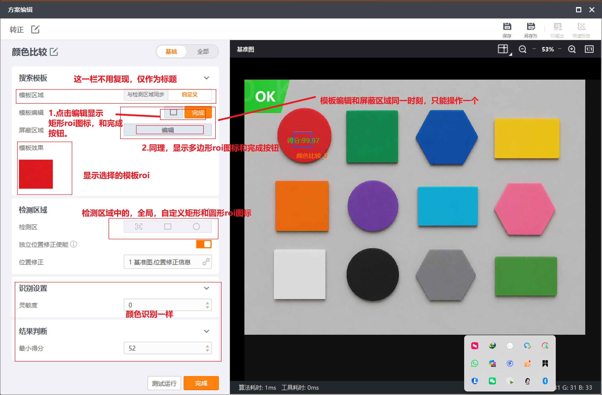
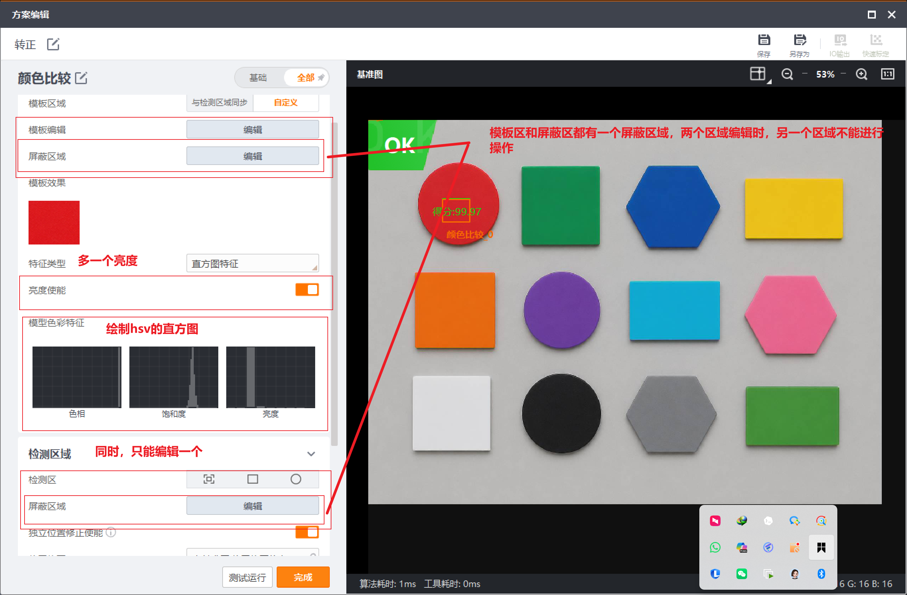

# 颜色比较功能实现记录

## 文档用途

本文档单独记录颜色比较算子的需求、实现方案、每次实现的功能、更改内容、错误问题、验证结果和剩余事项。后续继续开发颜色比较时，以根目录 `AGENTS.md` 的项目约束和 HALCON 约束为最高规则，以本文档作为功能状态追踪依据。

## 参考截图

- 基础页参考：`docs/FID/ColorComparison/颜色比较基础.png`
- 全部页参考：`docs/FID/ColorComparison/颜色比较全部.png`

截图中的红色标注是本功能 UI 和交互要求的一部分：

- `搜索模板` 这一栏不用复现，仅作为截图标题参考。
- 第一版不创建 `模板区域=与检测区域同步` 控件，也不实现该模式。
- 模板区域第一版只保留 `自定义` 模板 ROI 编辑。
- 模板编辑显示矩形 ROI 图标和 `完成` 按钮。
- 屏蔽区域显示多边形 ROI 图标和 `完成` 按钮。
- 模板 ROI 与屏蔽 ROI 同一时刻只能编辑一个。
- 检测区域包含全局、矩形 ROI、圆形 ROI 图标。
- 全部页展示特征类型、亮度使能、模型色彩特征 HSV 直方图。
- 结果判断第一版使用最小得分阈值。

## 第一版目标

颜色比较第一版实现完整工具闭环：

- 工具库入口可见，能创建颜色比较工具。
- 配置对话框能保存、重新打开并回显模板 ROI、检测 ROI、屏蔽 ROI、识别设置和结果判断。
- 测试运行时使用 HALCON 算子提取模板 ROI 和检测 ROI 的 HSV 直方图特征。
- 算法按 `模板 ROI` 与 `检测 ROI` 的 HSV 直方图交集相似度评分，分数越高表示越相似。
- UI 显示 OK/NG、得分、ROI、耗时和错误状态。
- 空图像、无效 ROI、未设置模板、屏蔽区完全覆盖检测区、HALCON runtime 或符号缺失时不崩溃，并返回明确错误。

## 实现方案

### 总体链路

```text
ToolLibraryDialog / ToolsDialog
        |
        v
ColorComparisonDialog
        |
        v
ToolConfig.params / judgeRule
        |
        v
ColorComparisonAdapter
        |
        v
ColorComparisonHalconRunner
        |
        v
ToolResult / overlays / payload
```

第一版采用独立颜色比较工具链，不直接复用或改造 `ColorRecognitionHalconRunner`。颜色比较与颜色识别都可以使用相似的 HALCON HSV 直方图思路，但两个算子语义不同：

- 颜色识别：模板样本分类，输出类别。
- 颜色比较：模板 ROI 与检测 ROI 两块区域做相似度比较，输出分数。

第一版允许在 `ColorComparisonHalconRunner` 中少量复用颜色识别已有 HALCON 动态解析和直方图提取写法，以降低对颜色识别已有行为的影响。后续两个算子稳定后，再评估是否抽取共享的颜色直方图 HALCON helper。

### UI 结构

`ColorComparisonDialog` 参考现有颜色识别对话框和截图布局：

```text
ColorComparisonDialog
|
+-- 顶部标题栏
|
+-- 左侧参数区
|   +-- 基础 / 全部 分段按钮
|   |
|   +-- 模板区域卡片
|   |   +-- 模板区域
|   |   |   +-- 自定义
|   |   +-- 模板编辑
|   |   |   +-- 矩形 ROI 图标
|   |   |   +-- 完成
|   |   +-- 屏蔽区域
|   |       +-- 编辑
|   |       +-- 多边形 ROI 图标
|   |       +-- 完成
|   |
|   +-- 模板效果卡片
|   |   +-- 当前模板 ROI 缩略图
|   |
|   +-- 全部页扩展参数
|   |   +-- 特征类型：直方图特征
|   |   +-- 亮度使能
|   |   +-- 模型色彩特征：色相 / 饱和度 / 亮度直方图
|   |
|   +-- 检测区域卡片
|   |   +-- 全局
|   |   +-- 矩形 ROI
|   |   +-- 圆形 ROI
|   |   +-- 检测区内屏蔽区域编辑
|   |
|   +-- 识别设置卡片
|   |   +-- 灵敏度
|   |
|   +-- 结果判断卡片
|       +-- 最小得分
|
+-- 右侧图像预览区
|   +-- 基准图 / 当前图像
|   +-- 模板 ROI / 检测 ROI / 屏蔽 ROI / 结果 overlay
|   +-- 底部状态栏
|
+-- 底部按钮
    +-- 测试运行 / 停止测试
    +-- 完成
```

### ROI 交互状态

ROI 编辑状态应使用单一状态管理，避免多个绘制状态互相污染：

```text
None
TemplateRect
TemplateMaskPolygon
DetectRect
DetectCircle
DetectMaskPolygon
```

约束：

- 进入模板 ROI 编辑时，关闭屏蔽 ROI、检测 ROI、圆形 ROI 绘制。
- 进入屏蔽 ROI 编辑时，关闭模板 ROI、检测 ROI、圆形 ROI 绘制。
- 进入检测 ROI 编辑时，关闭模板 ROI 和屏蔽 ROI 绘制。
- 点击对应 `完成` 后退出编辑状态，并保留 ROI 配置。
- 右侧预览区只显示当前编辑所需 ROI 和结果 overlay，避免旧 overlay 残留。

### 配置字段

第一版建议保存到 `ToolConfig.params` 和 `judgeRule`：

```text
ToolConfig
|
+-- toolType = ColorComparison
+-- category = Recognition
+-- roiNormalized
|   +-- 检测矩形 ROI 或圆形外接矩形；全局为整图
|
+-- params
|   +-- colorComparison
|   |   +-- version = 1
|   |   +-- templateRegionMode = "custom"
|   |   +-- templateRoiNormalized
|   |   +-- templateMaskPolygon
|   |   +-- templateFeature
|   |   +-- templateThumbnailPngBase64
|   |   +-- templateThumbnailWidth
|   |   +-- templateThumbnailHeight
|   |   +-- featureType = "histogram"
|   |   +-- sensitivity
|   |   +-- brightnessEnabled
|   |   +-- detectRegionType
|   |   +-- detectCircleNormalized
|   |   +-- detectMaskPolygon
|   |   +-- halconSoPath
|
+-- judgeRule
    +-- mode = "min_score"
    +-- minScore
```

默认值：

- `templateRegionMode=custom`
- `featureType=histogram`
- `sensitivity=medium`
- `brightnessEnabled=true`
- `detectRegionType=rectangle`
- `minScore=52`

### HALCON 算法约束

核心算法必须使用 HALCON，不允许使用 OpenCV、自写算法或第三方库替代。OpenCV 只作为工程侧 `cv::Mat` 图像载体和必要格式桥接。

第一版需要确认并使用的 HALCON 接口：

- `gen_image_interleaved`：将工程侧 BGR `cv::Mat` 桥接为 HALCON image。
- `decompose3`：拆分三通道图像。
- `trans_from_rgb`：转换到 HSV 空间。
- `gen_rectangle1`：生成矩形模板或检测 ROI。
- `gen_circle`：生成圆形检测 ROI。
- `gen_region_polygon_filled`：生成屏蔽多边形 region。
- `difference`：从模板或检测 ROI 中扣除屏蔽区域。
- `area_center`：检查有效 ROI 面积。
- `reduce_domain`：限制 H/S/V 通道统计 domain。
- `gray_histo_range`：提取 H/S/V 直方图。
- `tuple_min2`：计算直方图交集逐 bin 最小值。
- `tuple_sum`：计算交集和特征总和。

HALCON runtime、license 或必要符号缺失时必须返回明确错误，例如 `halcon_load_failed`、`halcon_symbol_missing`，不允许 fallback 到非 HALCON 算法。

### 算法流程

```text
输入图像 cv::Mat
        |
        v
转换为 8-bit BGR
        |
        v
HALCON image
        |
        v
HSV 三通道
        |
        +-- 模板 ROI region
        |       +-- 扣除模板屏蔽 region
        |       +-- 提取模板 H/S/V 直方图
        |
        +-- 检测 ROI region
                +-- 扣除检测屏蔽 region
                +-- 提取检测 H/S/V 直方图
        |
        v
直方图交集相似度
        |
        v
score = clamp(similarity * 100, 0, 100)
        |
        v
score >= minScore -> OK，否则 NG
```

直方图维度：

- `sensitivity=low`：每通道 8 bins。
- `sensitivity=medium`：每通道 16 bins。
- `sensitivity=high`：每通道 32 bins。
- `brightnessEnabled=false`：只比较 H + S。
- `brightnessEnabled=true`：比较 H + S + V。

相似度公式：

```text
intersection = sum(min(templateFeature, detectFeature))
normalizer = min(sum(templateFeature), sum(detectFeature))
similarity = normalizer > 0 ? intersection / normalizer : 0
score = similarity * 100
```

### 结果 payload

`ToolResult.payload` 至少包含：

```text
algorithm = "halcon_hsv_histogram_comparison"
featureType
sensitivity
brightnessEnabled
lightingNormalizationMode
comparisonMethod = "hsv_histogram_intersection"
scoreDirection = "higher_is_better"
scoreFormula = "histogram_intersection_similarity_x100"
similarity
score
histogramBins
featureLength
templateRoiPixelsRect
detectRoiPixelsRect
templateMaskApplied
detectMaskApplied
templateMaskFullyCoversRoi
detectMaskFullyCoversRoi
effectiveTemplateRoiArea
effectiveDetectRoiArea
detectRegionType
elapsedMs
judgeMode
minScore
```

### 错误状态

| 场景 | 状态 |
| --- | --- |
| 空图像 | `image_empty` |
| 模板 ROI 无效 | `invalid_template_roi` |
| 检测 ROI 无效 | `invalid_detect_roi` |
| 未设置模板特征 | `no_template_feature` |
| 模板 ROI 被屏蔽区完全覆盖 | `template_masked_empty` |
| 检测 ROI 被屏蔽区完全覆盖 | `detect_masked_empty` |
| 色谱特征 | `unsupported_feature` |
| HALCON runtime 文件找不到 | `halcon_so_not_found` |
| HALCON runtime 加载失败 | `halcon_load_failed` |
| HALCON 符号缺失 | `halcon_symbol_missing` |
| 其他异常 | `exception` |

## 实现记录

### 2026-07-01 10:30:26 CST - 位置修正内部链路和 FID 公有规范补齐

#### 已实现功能

- 颜色比较位置修正内部链路补齐到与有无工具一致的占位实现方式。
- Adapter 解析并透传 `enablePositionCorrection` 和 `positionCorrectionSource`。
- Runner payload 输出位置修正请求、来源、是否应用和未应用原因。
- 新增 `docs/FID/Function_Docs.md`，沉淀 FID 功能公有约束和位置修正统一规范。
- 更新颜色比较、颜色识别提示词规范，要求按 `AGENTS.md` 和 `docs/FID/Function_Docs.md` 约束开发。

#### 本次更改

- `src/algorithms/recognition/ColorComparisonHalconRunner.h`
  - `ColorComparisonHalconConfig` 增加 `enablePositionCorrection`、`positionCorrectionSource`。
- `src/tooladapters/ColorComparisonAdapter.cpp`
  - 从 `params.colorComparison` 解析位置修正字段并传入 runner。
- `src/algorithms/recognition/ColorComparisonHalconRunner.cpp`
  - 错误和正常 payload 均输出 `enablePositionCorrection`、`positionCorrectionSource`、`positionCorrectionApplied=false`、`positionCorrectionReason=not implemented`。
- `docs/FID/Function_Docs.md`
  - 新增 FID 公有约束、通用开发链路、位置修正统一规范、文档维护和验证要求。
- `docs/FID/ColorComparison/颜色比较提示词规范.md`、`docs/FID/ColorRecognition/颜色识别提示词规范.md`
  - 增加 `docs/FID/Function_Docs.md` 约束引用。

#### 出现的问题与处理

- 问题：上一版位置修正只在颜色比较 Dialog 中保存和回显，adapter/runner 没有感知，内部链路不等同于有无工具。
  处理：按有无工具现有占位实现方式补齐配置透传和 payload 输出，明确暂未实际应用位置补偿。

#### 验证

- 执行 `/home/tt/Qt/5.15.2/gcc_64/bin/qmake smoke/color_comparison_smoke.pro -o /tmp/color_comparison_smoke.Makefile && make -f /tmp/color_comparison_smoke.Makefile -j4 && ./color_comparison_smoke`，通过。
- 执行 `/home/tt/Qt/5.15.2/gcc_64/bin/qmake qt_ui_test.pro && make -j8 && git diff --check`，通过。

#### 剩余事项

- 位置修正仍为统一占位链路，尚未实现实际 ROI 坐标补偿算法。

### 2026-07-01 10:11:05 CST - 检测区域位置修正使能补充

#### 已实现功能

- 在颜色比较 `检测区域` 卡片中补充 `独立位置修正使能 ⓘ` 开关。
- 开关开启时显示 `位置修正` 下拉框，关闭时隐藏下拉框。
- 下拉框第一版提供 `1 基准图.位置修正信息`，与有无工具同类控件文案保持一致。
- 位置修正开关和来源写入 `colorComparison` 参数，并在重新打开工具时回显。

#### 本次更改

- `src/ColorComparisonDialog.h`
  - 新增位置修正使能、来源和相关 UI 控件成员。
- `src/ColorComparisonDialog.cpp`
  - 在检测区域 ROI 三图标下方新增位置修正开关行和来源行。
  - 新增 `refreshPositionCorrectionControls()` 统一维护开关、下拉框和来源行显隐。
  - `colorComparisonParams()`、`loadFromConfig()` 增加 `enablePositionCorrection` 和 `positionCorrectionSource`。

#### 出现的问题与处理

- 问题：颜色比较检测区域缺少与有无工具一致的位置修正使能区域。
  处理：参考有无工具的 `独立位置修正使能 ⓘ / 位置修正` 文案和 `positionCorrectionSwitch` 样式接入，默认关闭并隐藏来源行。

#### 验证

- 执行 `/home/tt/Qt/5.15.2/gcc_64/bin/qmake qt_ui_test.pro && make -j8 && git diff --check`，通过。

#### 剩余事项

- 位置修正参数第一版仅保存和回显，颜色比较 adapter/runner 暂未消费该参数。
- 仍需在图形环境中确认开关显示位置、开启后来源行显示、关闭后来源行隐藏。

### 2026-07-01 09:59:29 CST - 检测区域 ROI 按钮状态修正

#### 已实现功能

- 检测区域恢复为三个 ROI 图标按钮：全图、矩形、圆形。
- 移除检测区域额外的 `编辑 / 完成` 控件。
- 点击矩形或圆形图标后直接进入对应 ROI 绘制，点击全图后设置全图检测区域并退出绘制。

#### 本次更改

- `src/ColorComparisonDialog.h`
  - 删除检测区 `m_detectEditButton` 和 `m_detectFinishButton` 成员。
- `src/ColorComparisonDialog.cpp`
  - 删除检测区 `编辑 / 完成` 按钮创建、布局和信号连接。
  - 保留全图、矩形、圆形三个图标按钮，并继续通过 `refreshDetectRegionButtons()` 同步 checked 状态。

#### 出现的问题与处理

- 问题：上一版把检测区也做成了 `编辑 / 完成` 状态流，但检测区域要求参考有无工具，只保留三个图标按钮作为入口。
  处理：移除检测区额外状态按钮，矩形和圆形图标直接进入绘制模式，全图图标直接设置全图 ROI。

#### 验证

- 执行 `/home/tt/Qt/5.15.2/gcc_64/bin/qmake qt_ui_test.pro && make -j8 && git diff --check`，通过。

#### 剩余事项

- 仍需在图形环境中确认检测区域三图标位置与有无工具风格一致，并手动验证矩形/圆形拖拽。

### 2026-07-01 09:35:18 CST - 颜色比较 ROI 编辑和模板效果修复

#### 已实现功能

- 模板编辑和屏蔽区域编辑改为互斥编辑态，默认只显示 `编辑`，进入编辑后显示对应 ROI 图标和 `完成`。
- 模板效果从坐标文本改为显示当前模板 ROI 的真实裁剪缩略图。
- 检测区域补充 `编辑 / 完成` 交互，支持全图、矩形 ROI、圆形 ROI 的选择和回显。
- 切换编辑态时保留已保存的 ROI 数据，并同步检测区域按钮 checked 状态。

#### 本次更改

- `src/ColorComparisonDialog.h`
  - 新增预览图缓存、检测区编辑按钮成员、模板 ROI 裁剪和控件刷新函数声明。
- `src/ColorComparisonDialog.cpp`
  - 新增检测区 `编辑 / 完成` 按钮。
  - 新增 `templateRoiImage()` 裁剪当前基准图或相机图像中的模板 ROI。
  - 新增 `refreshEditControls()` 和 `refreshDetectRegionButtons()` 统一维护按钮显隐与选中态。
  - 优化 `setEditState()` 状态提示，区分模板 ROI、模板屏蔽、检测矩形、检测圆形和检测屏蔽编辑。

#### 出现的问题与处理

- 问题：原实现进入界面时矩形/多边形图标和完成按钮常驻显示，和截图要求的 `编辑 -> ROI 图标 + 完成 -> 编辑` 状态流不一致。
  处理：以 `m_editState` 为唯一来源统一刷新控件显隐，确保同一时刻只编辑一个目标。
- 问题：模板效果只显示归一化坐标，无法直观看到模板区域图像。
  处理：缓存当前预览图并按模板 ROI 裁剪缩略图显示，无图像时显示 `无模板图像`。
- 问题：检测区缺少明确的位置编辑入口。
  处理：新增检测区 `编辑 / 完成`，矩形和圆形按钮可直接进入对应绘制模式，全图按钮退出绘制并设置全图 ROI。

#### 验证

- 执行 `/home/tt/Qt/5.15.2/gcc_64/bin/qmake qt_ui_test.pro && make -j8`，通过。
- 执行 `/home/tt/Qt/5.15.2/gcc_64/bin/qmake smoke/color_comparison_smoke.pro -o /tmp/color_comparison_smoke.Makefile && make -f /tmp/color_comparison_smoke.Makefile -j4 && ./color_comparison_smoke`，通过。
- 执行 `/home/tt/Qt/5.15.2/gcc_64/bin/qmake qt_ui_test.pro && make -j8 && git diff --check`，通过。

#### 剩余事项

- 仍需在图形环境中手动验证模板 ROI 缩略图、检测矩形/圆形拖拽、保存后重新打开回显。

### 2026-06-30 18:15:33 CST - 工具列表图标补充

#### 已实现功能

- 确认资源层已有 `:/icons/compare.svg`，且 `resources/resources.qrc` 已注册该图标。
- 确认工具库选择页中，颜色识别和颜色比较按钮均引用 `:/icons/compare.svg`。
- 在工具配置页左侧已添加工具列表卡片中新增工具类型图标。
- 颜色识别和颜色比较在工具列表卡片中均显示 `compare.svg` 图标。

#### 本次更改

- `src/ToolsDialog.cpp`
  - 新增 `toolIconForType()`，按 `ToolType` 返回工具图标路径。
  - 在 `createToolCard()` 中新增 `toolTypeIconLabel`，显示工具类型图标。
  - `ColorRecognition` 和 `ColorComparison` 均映射到 `:/icons/compare.svg`。
- `styles/app.qss`
  - 新增 `toolTypeIcon` 样式，固定工具列表图标的白底、边框和圆角。

#### 出现的问题与处理

- 问题：颜色比较在工具配置页左侧工具列表卡片中没有对应工具图标。
  处理：排查后确认资源已经注册，根因是工具列表卡片原本没有绘制工具类型图标；新增类型图标控件和类型到图标的映射。

#### 验证

- 执行 `/home/tt/Qt/5.15.2/gcc_64/bin/qmake qt_ui_test.pro && make -j8 && git diff --check`，通过。

#### 剩余事项

- 本次未做人工 GUI 点击检查；建议后续在图形界面确认工具列表卡片中颜色比较图标显示效果。

### 2026-06-30 17:55:31 CST - 第一版代码实现

#### 已实现功能

- 新增颜色比较工具类型 `ToolType::ColorComparison`，支持字符串保存、读取和中文名称识别。
- 工具库 `ToolLibraryDialog` 新增 `颜色比较` 入口，可选择后进入配置流程。
- `ToolsDialog` 支持颜色比较工具新建、编辑、列表显示和预览快照保存。
- `MainWindow` 注册 `ColorComparisonAdapter`，工具链运行时可调度颜色比较。
- 新增 `ColorComparisonDialog`，实现第一版配置界面：
  - 顶部标题栏。
  - 左侧参数区。
  - `基础 / 全部` 分段按钮。
  - 模板区域、模板效果、检测区域、识别设置、结果判断。
  - 全部页显示模型色彩特征、亮度使能、检测屏蔽区域。
  - 右侧图像预览区和底部状态栏。
  - `测试运行` 和 `完成` 按钮。
- 新增 ROI 编辑状态：
  - `TemplateRect`
  - `TemplateMaskPolygon`
  - `DetectRect`
  - `DetectCircle`
  - `DetectMaskPolygon`
  - 进入任一编辑状态时关闭其他绘制状态。
- 新增 `ColorComparisonAdapter`，解析 `params.colorComparison` 和 `judgeRule`，调用颜色比较 runner 并转换为 `ToolResult`。
- 新增 `ColorComparisonHalconRunner`，第一版使用 HALCON HSV 直方图特征比较：
  - 模板 ROI 提取 HSV 直方图。
  - 检测 ROI 提取 HSV 直方图。
  - 使用直方图交集相似度得到 `similarity`。
  - 输出 `score = similarity * 100`。
  - 按 `minScore` 判定 OK/NG。
- 新增 `smoke/color_comparison_smoke.cpp` 和 `smoke/color_comparison_smoke.pro`。

#### 本次更改

- `src/toolcore/ToolTypes.h`
  - 增加 `ColorComparison` 枚举、字符串映射和中文识别。
- `src/ToolLibraryDialog.cpp`
  - 将 `colorComparisonToolButton` 加入按钮组。
  - 选择颜色比较时返回 `ToolType::ColorComparison`。
  - 预览区显示颜色比较说明。
- `ui/ToolLibraryDialog.ui`
  - 在识别工具区域新增 `颜色比较` 工具按钮。
- `src/ToolsDialog.cpp`
  - 接入 `ColorComparisonDialog` 的新建和编辑流程。
  - 工具列表显示名增加 `颜色比较`。
- `src/MainWindow.h`、`src/MainWindow.cpp`
  - 注册 `ColorComparisonAdapter`。
  - 支持主界面编辑颜色比较工具。
  - 工具显示名增加 `颜色比较`。
- `src/ColorComparisonDialog.h`、`src/ColorComparisonDialog.cpp`
  - 新增颜色比较配置对话框。
  - 保存和回显 `params.colorComparison`、`judgeRule.minScore`。
  - 支持模板 ROI、模板屏蔽 ROI、检测 ROI、圆形检测 ROI、检测屏蔽 ROI。
  - 支持测试运行和结果 overlay 显示。
- `ui/ColorComparisonDialog.ui`
  - 新增 Qt Designer 占位文件，保持工程 UI 文件入口一致。
- `src/tooladapters/ColorComparisonAdapter.h`、`src/tooladapters/ColorComparisonAdapter.cpp`
  - 新增颜色比较 adapter。
- `src/algorithms/recognition/ColorComparisonHalconRunner.h`、`src/algorithms/recognition/ColorComparisonHalconRunner.cpp`
  - 新增颜色比较 HALCON runner。
- `qt_ui_test.pro`
  - 加入颜色比较 dialog、adapter、runner、ui 文件。
- `smoke/color_comparison_smoke.cpp`、`smoke/color_comparison_smoke.pro`
  - 新增颜色比较 smoke 测试。

#### 出现的问题与处理

- 问题：TDD RED 阶段 smoke 编译失败，提示 `ColorComparisonHalconRunner.h` 和 `.cpp` 不存在。
  处理：新增 `ColorComparisonHalconRunner.h/.cpp`。
- 问题：首次链接 smoke 时失败，原因是颜色比较 runner 第一版复用现有颜色识别 HALCON 特征提取链路，但 smoke 工程未链接 `ColorRecognitionHalconRunner.cpp`。
  处理：在 `smoke/color_comparison_smoke.pro` 中加入 `../src/algorithms/recognition/ColorRecognitionHalconRunner.cpp`。
- 问题：对话框最初将同一批控件同时加入基础页和全部页，Qt 会 reparent 控件，导致基础页可能缺少控件。
  处理：改为单套控件，`基础 / 全部` 分段只控制高级特征卡片和检测屏蔽行的显隐。

#### 验证

- 执行 `/home/tt/Qt/5.15.2/gcc_64/bin/qmake smoke/color_comparison_smoke.pro -o /tmp/color_comparison_smoke.Makefile && make -f /tmp/color_comparison_smoke.Makefile -j4 && ./color_comparison_smoke`，通过。
- 执行 `/home/tt/Qt/5.15.2/gcc_64/bin/qmake qt_ui_test.pro && make -j8`，通过。

#### 剩余事项

- 当前 `ColorComparisonHalconRunner` 第一版复用 `ColorRecognitionHalconRunner::extractFeature()` 获取 HALCON HSV 直方图，比较语义已独立在颜色比较 runner 内；后续可评估抽取共享 `ColorHistogramHalconHelper`，减少重复和语义耦合。
- 当前 `ColorComparisonDialog` 是代码构建 UI，`ui/ColorComparisonDialog.ui` 仅作为工程占位；后续若需要 Qt Designer 精细维护，可将布局迁移到 `.ui` 文件。
- 当前模板效果以 ROI 文本摘要显示，后续可补充真实模板 ROI 缩略图和 HSV 直方图绘制。
- 本次未做人工点击检查；后续应在图形环境中手动验证按钮、ROI 编辑、保存回显和测试运行。

### 2026-06-30 19:59:00 CST - 添加工具弹窗颜色比较图标可见性修复

#### 已实现功能

- `添加工具` 弹窗中，颜色比较工具在 `识别工具` 分组可见。
- `全部工具` 展示识别工具分组时，颜色比较同样可见。
- 颜色比较继续复用颜色识别同款图标 `:/icons/compare.svg`。

#### 本次更改

- `ui/ToolLibraryDialog.ui`
  - 将 `colorComparisonToolButton` 从识别工具网格 `row=1, column=4` 移动到 `row=2, column=0`。

#### 出现的问题与处理

- 问题：颜色比较按钮已经注册到 `ToolLibraryDialog` 按钮组，也已经使用 `:/icons/compare.svg`，但在 `识别工具` 和 `全部工具` 视图中不可见。
  处理：检查 `.ui` 后确认按钮位于第 5 列，当前工具库内容区按 4 列稳定展示，按钮被放到右侧不可见区域；改放到下一行首列。

#### 验证

- 执行 `/home/tt/Qt/5.15.2/gcc_64/bin/qmake qt_ui_test.pro && make -j8`，通过。
- 执行 `git diff --check`，首次发现 `src/ToolLibraryDialog.cpp` 存在一处尾随空白，清理后复检通过。

#### 剩余事项

- 本次为布局修复，未改动工具类型注册、算法和 adapter。
- 仍建议后续在图形环境中手动打开 `添加工具`，分别点击 `全部工具` 和 `识别工具` 确认显示位置与选中态。

### 2026-06-30 17:33:42 CST - 第一版规划与文档结构

#### 已确认需求

- 第一版默认算法为 `模板 ROI` 与 `检测 ROI` 的 HSV 直方图交集相似度。
- 分数越高表示越相似。
- 第一版不实现 `模板区域=与检测区域同步`，对应 UI 控件也不创建。
- 颜色比较采用独立工具链，不直接复用或修改颜色识别 runner 语义。
- `color_comparison_function_implementation.md` 作为后续每次实现、错误、更改和验证记录的主文档。
- `颜色比较提示词规范.md` 记录后续可直接使用的具体实现提示词。

#### 本次更改

- 将原本只包含截图引用的颜色比较实现文档扩展为功能实施记录。
- 补充第一版 UI 范围、ROI 交互状态、配置字段、HALCON 算子链、算法流程、payload 和错误状态。
- 明确后续每次开发都应按时间追加记录。

#### 本次错误与处理

- 当前文档此前只有 `颜色比较基础.png` 引用，缺少可执行的字段、算法和验证说明。
- 本次通过文档补全处理，尚未进入代码实现。

#### 验证

- 本次仅修改文档，未运行 `qmake` 和 `make`。

### 2026-07-01 14:20:44 CST - 测试运行控件新规范落地

#### 已实现功能

- 按 `docs/FID/Function_Docs.md` 的 `测试运行统一规范` 调整颜色比较底部动作按钮。
- 编辑态底部按钮统一为：`基准图测试`、`测试运行`、`完成`。
- 新增测试态按钮切换：
  - 连续运行中显示 `停止运行`、`运行一次`、`退出测试`。
  - 停止后显示 `连续运行`、`运行一次`、`退出测试`。
- 点击 `测试运行` 后默认进入连续运行：
  - 连续运行只使用 `CameraFrameProvider::currentFrame()` 的实时最新帧。
  - `停止运行` 按钮使用橙色高亮。
  - 点击停止后保留最后一帧。
- `运行一次` 只获取实时最新帧，不使用基准图。
- `退出测试` 停止连续运行并恢复编辑态按钮。
- `基准图测试` 只使用 `ReferenceImageProvider::referenceFrame()`，基准图为空时返回 `no_reference_image`，不回退实时帧。

#### 本次更改

- `src/ColorComparisonDialog.h`：新增测试态枚举、定时器、防重入状态和底部按钮成员。
- `src/ColorComparisonDialog.cpp`：新增基准图测试、连续运行、停止运行、运行一次、退出测试和按钮状态刷新逻辑。

#### 出现的问题与处理

- 问题：原实现只有单个 `测试运行` 按钮，且测试帧源会优先基准图再回退相机图像，不符合公共规范。
  处理：拆分为 `基准图测试` 与实时测试两条路径，实时连续/单次测试固定使用 `CameraFrameProvider::currentFrame()`。

#### 验证

- 已执行 `/home/tt/Qt/5.15.2/gcc_64/bin/qmake qt_ui_test.pro && make -j8`，编译链接通过。

#### 剩余事项

- 仍需在真实 GUI 中手动确认按钮显隐、高亮、连续运行视频刷新、停止后保留最后一帧和退出测试后的编辑态恢复。

### 2026-07-01 18:17:00 CST - 测试按钮族样式 C 方案分层权重

#### 已实现功能

- 测试按钮族视觉样式改为 C 方案分层权重，补齐原 QSS 缺失的 `:hover`、`[running="true"]`、`:disabled` 规则。
- 三档视觉层级：完成/运行一次（`testPrimary`）深色实心；测试运行/基准图测试（`testAction`）白底灰边，连续运行态橙色实心 `#ff7a00`；退出测试（`#exitTestButton`）透明弱化、hover 红警示。

#### 本次更改

- `src/ColorComparisonDialog.cpp`：替换 `buildUi()` 内联 QSS 块为完整规则集；在 `m_exitTestButton` 设置 actionRole 后补一行 `setObjectName("exitTestButton")`，使 QSS `#exitTestButton` 选择器能定向到退出测试按钮（此前比较侧缺此 objectName，识别侧已有）。
- 不改动：`installActionButtonFlash`、`running` 属性设置点、`refreshButtonStyle`、`applyBottomActionButtonMetrics`、所有信号槽连接。

#### 出现的问题与处理

- 问题：浏览器原型用了 `box-shadow`/`@keyframes`/`transition`/`::after`，Qt QSS 全不支持。
  处理：降级为纯色与边框色变化，hover 用底色+边框色、running 用静态橙色实心、flash 仍为硬切反色（退出测试为红切），三档层级靠底色区分。

#### 验证

- 已执行 `/home/tt/Qt/5.15.2/gcc_64/bin/qmake qt_ui_test.pro && make -j$(nproc)`，强制重编 `ColorComparisonDialog.cpp` + 链接通过，`-Wall -Wextra` 无相关警告。

#### 剩余事项

- 真实 GUI 手动确认四按钮的默认/hover/点击 flash/连续运行橙色态/disabled 灰化，以及基础/全部分段、检测区域 ROI 绘制、完成/退出流程等回归不受影响。

### 2026-07-02 10:02:09 CST - 检测区域结果文字跟随检测框显示

#### 已实现功能

- 颜色比较测试运行后，结果文字显示方式对齐颜色识别。
- 检测 ROI 上显示 `OK/NG score:x.x` 结果文字。
- 当检测框足够大时，结果文字居中显示在检测框内。
- 当检测框较小时，结果文字按 `FrameViewHelper` 现有规则显示在检测框上方、下方或右侧，避免被检测框遮挡。

#### 本次更改

- `src/algorithms/recognition/ColorComparisonHalconRunner.cpp`
  - 新增归一化 ROI 到像素 ROI 的转换。
  - 将模板 ROI、检测 ROI、屏蔽多边形 overlay 改为像素坐标输出，匹配 `FrameViewHelper::setToolOverlays()` 的显示坐标体系。
  - 结果文字 overlay 使用 `label=color_result_text`。
  - 结果文字 overlay 增加 `extra.anchorRect`，复用颜色识别已有的检测框内/外自动摆放逻辑。
  - 圆形检测区域输出圆形 overlay，并用外接矩形作为结果文字锚点。

#### 出现的问题与处理

- 问题：颜色比较 runner 只输出固定位置 `OK/NG` 文本，且没有 `color_result_text` 和 `anchorRect`，因此无法像颜色识别一样把结果显示到检测框上。
  处理：按颜色识别 runner 的结果 overlay 结构补齐结果文字 label、状态字段和 anchorRect。
- 问题：颜色比较结果 overlay 原先使用归一化坐标，`FrameViewHelper` 的 tool overlay 渲染逻辑实际按图像像素坐标处理。
  处理：runner 输出 overlay 前统一转换为图像像素坐标。

#### 验证

- 已执行 `/home/tt/Qt/5.15.2/gcc_64/bin/qmake qt_ui_test.pro && make -j8`，编译链接通过。

#### 剩余事项

- 仍需在真实 GUI 中手动确认矩形/圆形检测区域上文字显示位置、OK/NG 颜色和小 ROI 外置显示效果。

### 2026-07-02 10:20:21 CST - 颜色比较评分稳定性修正

#### 已实现功能

- 颜色比较得分从“拼接 HSV 直方图硬分箱交集”调整为“HSV 通道分开比较 + 邻近 bin 平滑 + 分层权重汇总”。
- 保持默认算法语义仍为模板 ROI 与检测 ROI 的 HSV 直方图交集相似度，分数越高越相似。
- 对轻微色相、饱和度和亮度漂移更稳定，避免同类绿色 ROI 因落入相邻 bin 而出现异常低分。

#### 本次更改

- `src/algorithms/recognition/ColorComparisonHalconRunner.cpp`
  - 新增 HSV 直方图通道拆分比较。
  - Hue 通道按环形邻近 bin 平滑，Saturation/Value 通道按非环形邻近 bin 平滑。
  - 亮度使能时使用 `hue=0.55,saturation=0.30,value=0.15`；关闭亮度时使用 `hue=0.65,saturation=0.35`。
  - payload 中增加 `hueSimilarity`、`saturationSimilarity`、`valueSimilarity`、`hsvWeights`、`histogramSmoothing`，便于后续定位异常得分。
  - `comparisonMethod` 更新为 `hsv_histogram_intersection_smoothed_weighted`。
- `smoke/color_comparison_smoke.cpp`
  - 同步检查新的 `comparisonMethod`。

#### 出现的问题与处理

- 问题：原先把 H/S/V 三段直方图直接拼接后逐 bin 求交集，若同色区域受光照、材质或采样 ROI 影响落到相邻 bin，交集会接近 0，出现绿色与绿色得分极低、显示效果不符合直觉的问题。
  处理：保留 HALCON 提取 HSV 直方图的链路，只在比较阶段对相邻 bin 做平滑，并按 Hue/Saturation/Value 分层加权，降低硬分箱抖动造成的误判。
- 问题：需要保留“亮度使能”的 UI 语义。
  处理：亮度打开时参与 Value 通道但权重较低，避免亮度变化压过色相判断；亮度关闭时只比较 H/S。

#### 验证

- 已执行 `/home/tt/Qt/5.15.2/gcc_64/bin/qmake qt_ui_test.pro && make -j8`，主工程编译通过。
- 已执行 `qmake smoke/color_comparison_smoke.pro -o /tmp/color_comparison_smoke.Makefile && make -f /tmp/color_comparison_smoke.Makefile -j4`，颜色比较 smoke 编译通过。
- 已执行 `./color_comparison_smoke`，运行阶段因本机 HALCON license 缺失失败：`gen_image_interleaved: could not find license file`。该项为环境阻塞，待 HALCON license 可用后复测。

#### 剩余事项

- 需要在真实 GUI 中用同一张基准图复测绿色模板对上方绿色、下方绿色、青色、红色等 ROI 的分数梯度。
- 若仍出现同色低分，应继续结合 payload 中的三通道相似度判断是 Hue 漂移、饱和度漂移、亮度漂移还是 ROI 映射问题。

### 2026-07-02 10:45:21 CST - 颜色比较同色低分二次修正

#### 已实现功能

- 将颜色比较 HSV 相似度从邻近 bin 平滑进一步调整为软距离核匹配。
- 中等灵敏度下，Hue 相差少量 bin 且饱和度相近的同类颜色不再被硬分箱直接打成低分。
- 基础页固定不启用亮度；全部页才显示并保存“亮度使能”开关。

#### 本次更改

- `src/algorithms/recognition/ColorComparisonHalconRunner.h`
  - 新增 `ColorComparisonHsvSimilarity` 和 `compareColorComparisonHsvHistograms()`，用于不依赖 HALCON license 的纯 HSV 相似度测试。
  - `ColorComparisonHalconConfig::brightnessEnabled` 默认值改为 `false`。
- `src/algorithms/recognition/ColorComparisonHalconRunner.cpp`
  - HSV 通道比较改为 soft-kernel 加权匹配：Hue 使用环形距离，Saturation/Value 使用线性距离。
  - `comparisonMethod` 更新为 `hsv_histogram_soft_kernel_weighted`。
  - payload 保留 `hueSimilarity`、`saturationSimilarity`、`valueSimilarity`、`hsvWeights` 和 `histogramSmoothing`，便于复查低分来源。
- `src/ColorComparisonDialog.cpp`
  - 初始化时真正进入基础模式并隐藏全部页高级项。
  - 基础模式保存配置时强制 `brightnessEnabled=false`、`featureType=histogram`。
  - 全部模式下才读取亮度复选框；加载旧配置时若启用了亮度、色谱或检测屏蔽，则回显到全部模式。
- `smoke/color_comparison_smoke.cpp`
  - 新增纯 HSV 相似度断言：邻近绿色 Hue 应超过 70 分，远 Hue 应低于匹配阈值。
  - 同步新的 `comparisonMethod` 和亮度默认值。

#### 出现的问题与处理

- 问题：上一版只做相邻 bin 平滑，若两块视觉上相近的绿色跨过多个 Hue bin，分数仍可能偏低。
  处理：改为按 bin 距离衰减的 soft-kernel 相似度，既允许小范围 Hue 漂移，也保留远色相低分。
- 问题：基础页只设置了“基础”按钮 checked，但没有真正调用基础模式显隐与保存逻辑，可能误把亮度开关状态带入基础测试。
  处理：初始化调用 `setAllParamsMode(false)`，保存时按当前基础/全部模式决定亮度是否参与。

#### 验证

- 已执行 `/home/tt/Qt/5.15.2/gcc_64/bin/qmake qt_ui_test.pro && make -j8`，主工程编译链接通过。
- 已执行 `qmake smoke/color_comparison_smoke.pro -o /tmp/color_comparison_smoke.Makefile && make -f /tmp/color_comparison_smoke.Makefile -j4`，颜色比较 smoke 编译通过。
- 已执行 `./color_comparison_smoke`，纯 HSV 相似度断言通过后进入 HALCON runner 阶段；运行阶段仍因本机 HALCON license 缺失失败：`gen_image_interleaved: could not find license file`。

#### 剩余事项

- 需要在真实 GUI 中复测与海康软件同一张图、同一模板 ROI、同一检测 ROI 的分数。
- 若仍低于预期，应优先读取 payload 中三通道相似度；若 Hue/Saturation 已合理但总体仍不贴近海康，需要补充“主色覆盖率/颜色区域占比”模式，而不是继续扩大 Hue 容差。

### 2026-07-02 11:16:38 CST - 颜色比较青蓝误判高分修正

#### 已实现功能

- 将颜色比较评分进一步改为模板主 Hue 覆盖率主导，避免绿色模板下青色、蓝色因饱和度相近而被判高分。
- 基础模式仍不启用亮度；亮度只在全部页勾选后参与 Value 通道。
- 新增纯 HSV 断言：绿色模板下，近邻绿色需通过，青色和蓝色必须低于匹配阈值。

#### 本次更改

- `src/algorithms/recognition/ColorComparisonHalconRunner.cpp`
  - 新增模板 Hue 直方图主峰提取。
  - 新增 `templateDominantHueCoverage()`：按模板主 Hue 对检测 Hue 分布做覆盖率评分。
  - Hue 相似度改为 `模板主 Hue 覆盖率 0.80 + 直方图 soft similarity 0.20`。
  - 基础模式权重改为 `hue=0.80,saturation=0.20`。
  - 亮度启用时权重改为 `hue=0.70,saturation=0.15,value=0.15`。
  - payload 的 `scoreFormula`、`hsvWeights`、`hueComparisonMode` 同步更新。
- `smoke/color_comparison_smoke.cpp`
  - 绿色近邻测试从 Hue 偏移 2 bin 调整为偏移 1 bin。
  - 新增 cyan/blue 不能作为 green 高分通过的断言。

#### 出现的问题与处理

- 问题：上一版 soft-kernel 过于宽松，绿色模板下青色仍可得到约 63.9 的纯算法相似度，和截图中的“青色/蓝色高分”现象一致。
  处理：将 Hue 分数从整体直方图相似度改为模板主色覆盖率主导，青色、蓝色需要真正落在模板主 Hue 附近才可得高分。
- 问题：主工程构建时，根目录中 smoke 子工程生成的同名对象文件曾干扰主工程链接。
  处理：按 AGENTS 工程卫生要求清理 `.gitignore` 覆盖的 qmake 构建产物后重新全量构建。

#### 验证

- 已执行清理后 `/home/tt/Qt/5.15.2/gcc_64/bin/qmake qt_ui_test.pro && make -j8`，主工程全量编译链接通过。
- 已执行 `qmake smoke/color_comparison_smoke.pro -o /tmp/color_comparison_smoke.Makefile && make -f /tmp/color_comparison_smoke.Makefile -j4 && ./color_comparison_smoke`，纯 HSV 相似度断言通过；随后进入 HALCON runner 阶段时因本机 HALCON license 缺失失败：`gen_image_interleaved: could not find license file`。

#### 剩余事项

- 需要在 GUI 中复测绿色、青色、蓝色三组 ROI：青色/蓝色应不再高于绿色。
- 若海康分数仍有差异，下一步应补充“主色覆盖率/颜色区域占比”作为独立算法模式，并与海康的检测区域覆盖率语义对齐。

### 2026-07-02 11:54:18 CST - 新增 HALCON Bhattacharyya 直方图比较模式

#### 已实现功能

- 颜色比较“全部”页新增比较模式：
  - `模板主色覆盖率`：现有默认模式。
  - `Bhattacharyya直方图`：新增模式。
- 新增模式严格要求调用 HALCON `compare_histogram` 语义对应的 `T_compare_histogram` 符号，方法参数为 `bhattacharyya`。
- 不实现 C++ 自算 Bhattacharyya，不做静默降级。
- Bhattacharyya 模式得分公式为 `(1.0 - Dist) * 100`，距离越小得分越高。

#### 本次更改

- `src/ColorComparisonDialog.cpp/.h`
  - “模型色彩特征”卡片新增 `比较模式` 下拉框。
  - 基础页仍固定保存 `comparisonMode=dominant_hue_coverage`。
  - 全部页选择 `Bhattacharyya直方图` 时保存 `comparisonMode=bhattacharyya_histogram`。
  - 重新打开旧配置时，若保存了 Bhattacharyya 模式，则自动回显到“全部”页。
- `src/tooladapters/ColorComparisonAdapter.cpp`
  - 解析并传递 `comparisonMode`。
- `src/algorithms/recognition/ColorComparisonHalconRunner.h/.cpp`
  - `ColorComparisonHalconConfig` 新增 `comparisonMode`。
  - runner 根据 `comparisonMode` 分支：
    - `dominant_hue_coverage`：保留现有模板主 Hue 覆盖率算法。
    - `bhattacharyya_histogram`：调用 `ColorRecognitionHalconRunner::compareHistogramBhattacharyya()`。
  - payload 增加 `comparisonMode`、`distance`、`halconOperator=compare_histogram`、`halconCompareMethod=bhattacharyya`。
- `src/algorithms/recognition/ColorRecognitionHalconRunner.h/.cpp`
  - 新增 `ColorRecognitionHalconHistogramCompareResult`。
  - 新增 `compareHistogramBhattacharyya()`，内部通过动态 HALCON API 调用 `T_compare_histogram(HistRef, HistTest, 'bhattacharyya', Dist)`。
  - `T_compare_histogram` 使用可选符号绑定，缺失时返回 `halcon_symbol_missing`。

#### 出现的问题与处理

- 问题：本机 HALCON 24.11.1.0 的头文件和动态库中未检索到 `compare_histogram` / `T_compare_histogram` 导出。
  处理：按 HALCON 红线，不用 C++ 替代实现；Bhattacharyya 模式只在运行时符号存在时执行，符号缺失时返回明确错误。
- 问题：smoke 执行仍在 `gen_image_interleaved` 阶段因 HALCON license 缺失失败，无法进入 `compare_histogram` 分支。
  处理：记录为环境阻塞；代码层面已完成编译验证。

#### 验证

- 已执行 `/home/tt/Qt/5.15.2/gcc_64/bin/qmake qt_ui_test.pro && make -j8`，主工程编译链接通过。
- 已执行 `qmake smoke/color_comparison_smoke.pro -o /tmp/color_comparison_smoke.Makefile && make -f /tmp/color_comparison_smoke.Makefile -j4 && ./color_comparison_smoke`，smoke 编译通过；运行阶段仍因本机 HALCON license 缺失失败：`gen_image_interleaved: could not find license file`。
- 已执行 `git diff --check`，无空白错误。

#### 剩余事项

- 需要在具备 HALCON license 且存在 `T_compare_histogram` 符号的环境中复测 Bhattacharyya 模式。
- 若目标 HALCON 版本也没有该算子，应确认实际可用的 HALCON 直方图比较算子名称，再替换绑定符号；不应回退到 C++ 自算。

### 2026-07-02 15:51:51 CST - Bhattacharyya 模式改为 HALCON 基础算子组合

#### 已实现功能

- 确认当前目标机 HALCON 24.11.1 标准 2D 库不提供 `compare_histogram` / `T_compare_histogram`：
  - C/C++ 头文件未检索到该接口。
  - `libhalconc.so`、`libhalconcpp.so`、XL 变体导出符号中未检索到该接口。
  - 本地标准帮助文档只检索到 `gray_histo`、`gray_histo_range`、`histo_2dim` 等基础直方图算子。
- 颜色比较 `Bhattacharyya直方图` 模式不再依赖缺失的 `T_compare_histogram`。
- 新模式改为：
  - 继续使用 HALCON `T_gray_histo_range` 提取 HSV 直方图特征。
  - 使用 HALCON tuple 基础算子 `T_tuple_mult`、`T_tuple_sqrt`、`T_tuple_sum` 计算 Bhattacharyya 系数。
  - 距离公式当前为标准巴氏距离 `-ln(coefficient)`，分数公式为 `max(0, 1 - distance) * 100`。

#### 本次更改

- `src/algorithms/recognition/ColorRecognitionHalconRunner.cpp`
  - 移除 `T_compare_histogram` 可选符号依赖。
  - 新增动态解析 `T_tuple_mult`、`T_tuple_sqrt`。
  - `compareHistogramBhattacharyya()` 改为 HALCON 基础 tuple 算子组合实现。
  - payload 标记为 `algorithm=halcon_tuple_bhattacharyya`，并记录 `coefficient`、`referenceHistogramSum`、`testHistogramSum`。
- `src/algorithms/recognition/ColorComparisonHalconRunner.cpp`
  - Bhattacharyya 模式 payload 改为 `comparisonMethod=halcon_tuple_bhattacharyya_histogram`。
  - 移除 `halconOperator=compare_histogram` 的误导字段。
  - 记录 `halconOperators=T_gray_histo_range,T_tuple_mult,T_tuple_sqrt,T_tuple_sum`。
- `smoke/color_comparison_smoke.cpp`
  - 新增 Bhattacharyya 模式 smoke 断言：相同直方图距离应接近 0。
  - 默认只执行不依赖 HALCON license 的纯 HSV 断言。
  - 在具备可用 HALCON license 的目标机上设置 `RUN_HALCON_LICENSED_SMOKE=1` 后，才执行 Bhattacharyya tuple 和图像 runner 实测。
- `smoke/color_comparison_smoke.pro`
  - 新增 `v2_color_comparison_smoke/` 独立输出目录，避免 smoke 构建产物散落到源码根目录或干扰主工程同名对象文件；该目录匹配 `.gitignore` 的 `*_smoke` 规则。

#### 出现的问题与处理

- 问题：本机标准 HALCON 24.11.1 中没有 `T_compare_histogram`，直接调用会返回 `halcon_symbol_missing`，导致 UI 选择 Bhattacharyya 模式没有结果输出。
  处理：按用户确认的方案，放弃直接依赖扩展算子，改为所有版本更通用的 HALCON 基础算子组合。
- 问题：本机 `HALCON_LICENSE_FILE` 指向的 license 文件不存在，执行 `T_tuple_sum` 时 HALCON 会直接以 license 错误退出进程，无法在 smoke 内捕获。
  处理：smoke 默认不执行 HALCON license 相关算子；需要完整 HALCON 数值验证时，在具备有效 license 的目标机上显式设置 `RUN_HALCON_LICENSED_SMOKE=1`。

#### 验证

- 待执行主工程构建、smoke 和 `git diff --check`。

#### 剩余事项

- 在具备 HALCON license 的目标机上复测 `Bhattacharyya直方图` 模式，同一模板与检测 ROI 应输出接近 100 分，非同色 ROI 应按距离降低。
- 后续如需更强抗光照能力，可新增基于 `histo_2dim` 的 H+S 二维联合直方图模式，不影响当前一维 HSV 分段直方图模式。

### 2026-07-02 16:45:00 CST - 模板特征保存与运行语义修复

#### 已实现功能

- 明确颜色比较运行语义为“当前检测区与建模时保存的模板颜色特征比较”。
- 颜色比较配置现在保存并回显 `params.colorComparison.templateFeature`。
- 基准图测试和完成配置时会使用 HALCON 从基准图模板 ROI 提取模板特征并写入配置。
- runner 不再从当前测试图像重新提取模板特征；缺少保存特征时返回 `no_template_feature`。

#### 本次更改

- `src/ColorComparisonDialog.h/.cpp`
  - 新增 `m_templateFeature` 缓存。
  - `colorComparisonParams()` 写入 `templateFeature`，`loadFromConfig()` 读回。
  - 基准图测试前调用 `ColorRecognitionHalconRunner::extractFeature()` 生成模板 HSV 直方图。
  - 完成配置时若模板特征为空，会尝试从基准图提取；失败时不保存无效配置。
  - 模板 ROI、模板屏蔽、灵敏度、特征类型、亮度语义变化时清空旧模板特征。
- `src/algorithms/recognition/ColorComparisonHalconRunner.cpp`
  - 运行入口检查 `config.templateFeature`，为空时返回 `no_template_feature`。
  - 后续比较使用保存的模板特征，只对当前输入图提取检测 ROI 特征。
- `smoke/color_comparison_smoke.cpp`
  - 新增缺少保存模板特征的 smoke 断言，确保 runner 在 HALCON runtime 前返回 `no_template_feature`。
  - HALCON license smoke 分支显式设置 `config.templateFeature` 后再运行完整图像 runner。

#### 出现的问题与处理

- 问题：Adapter 已读取 `templateFeature`，runner 结构体也有字段，但 Dialog 没有写入/回显，runner 也忽略该字段并每次从当前图重提模板。
  处理：补齐 Dialog 写入/回显/建模提取，并让 runner 只消费保存特征。
- 问题：加载旧配置时切换基础/全部模式可能误清空刚读回的模板特征。
  处理：增加加载态保护，用户交互切换仍会清空旧特征，配置回显不会误清。

#### 验证

- 已执行 `qmake smoke/color_comparison_smoke.pro -o /tmp/color_comparison_smoke.Makefile && make -f /tmp/color_comparison_smoke.Makefile -j4 && ./v2_color_comparison_smoke/color_comparison_smoke`，smoke 通过；默认跳过需要 HALCON license 的图像 runner 分支。
- 已执行 `mkdir -p build && cd build && /home/tt/Qt/5.15.2/gcc_64/bin/qmake ../qt_ui_test.pro && make -j$(nproc)`，主工程编译链接通过。

#### 剩余事项

- 需要在具备有效 HALCON license 的目标机上执行 `RUN_HALCON_LICENSED_SMOKE=1 ./v2_color_comparison_smoke/color_comparison_smoke`。
- 需要在 GUI 中确认新建颜色比较后，点击完成或基准图测试能生成并保存模板特征，重新打开后可直接运行测试。

### 2026-07-02 17:05:00 CST - 巴氏距离公式调整为负对数形式

#### 已实现功能

- `Bhattacharyya直方图` 模式的距离公式从 `sqrt(1 - coefficient)` 改为常规巴氏距离 `D_B = -ln(BC)`。
- 巴氏距离结果不再裁剪到 `0..1`；颜色比较得分仍按 `max(0, 1 - distance) * 100` 避免负分。

#### 本次更改

- `src/algorithms/recognition/ColorRecognitionHalconRunner.cpp`
  - `compareHistogramBhattacharyya()` 中 `distance` 改为 `-std::log(coefficient)`。
  - 对 `coefficient=0` 使用 `std::numeric_limits<double>::min()` 做有限值保护。
- `src/algorithms/recognition/ColorComparisonHalconRunner.cpp`
  - 消费巴氏距离时去掉 `0..1` 上限裁剪。
  - payload `scoreFormula` 更新为 `max(0.0, 1.0 - bhattacharyya_distance) * 100`。
- `smoke/color_comparison_smoke.cpp`
  - 增加 `BC=0.25` 的 licensed smoke 断言，期望距离为 `-ln(0.25)`。

#### 验证

- 默认 smoke 可编译运行；完整巴氏距离数值断言仍需有效 HALCON license 后设置 `RUN_HALCON_LICENSED_SMOKE=1` 执行。

### 2026-07-02 17:20:00 CST - 巴氏距离 OpenCV 对照调试输出

#### 已实现功能

- 在 `Bhattacharyya直方图` 模式中增加 OpenCV 巴氏距离旁路调试。
- 每次 HALCON tuple 巴氏距离计算成功后，控制台输出：
  - `HALCON(tuple -ln(BC)) distance`
  - `BC`
  - `OpenCV(compareHist HISTCMP_BHATTACHARYYA) distance`
  - `absDiff`

#### 本次更改

- `src/algorithms/recognition/ColorRecognitionHalconRunner.cpp`
  - 新增 `openCvBhattacharyyaDebugDistance()`，使用 `cv::compareHist(..., cv::HISTCMP_BHATTACHARYYA)` 计算调试距离。
  - 使用 `qInfo().noquote()` 输出 HALCON 当前距离与 OpenCV 调试距离。
  - OpenCV 结果不写入 `ToolResult`、不写入 payload、不参与 OK/NG、不改变 HALCON 返回值。

#### 验证

- 已执行 `make -C build -j$(nproc)`，主工程编译链接通过。
- 已执行 `qmake smoke/color_comparison_smoke.pro -o /tmp/color_comparison_smoke.Makefile && make -f /tmp/color_comparison_smoke.Makefile -j4 && ./v2_color_comparison_smoke/color_comparison_smoke`，默认 smoke 通过。
- 已执行 `git diff --check`，无空白错误。

### 2026-07-02 18:55:00 CST - Bhattacharyya 模式改为 H/S 二维软核直方图

#### 已实现功能

- `Bhattacharyya直方图` 模式的特征提取改为 HALCON `T_histo_2dim(H,S)`。
- 二维 H/S histogram 从 HALCON 256x256 histogram image 聚合到当前灵敏度对应的 `bins x bins`。
- 聚合后增加 H 环形、S 邻域的 3x3 软核平滑，降低同色绿色落到相邻 Hue/Saturation bin 时的硬分箱低分。
- 默认 `模板主色覆盖率` 模式仍使用原一维 HSV 特征，不受影响。

#### 本次更改

- `src/ColorComparisonDialog.cpp`
  - 全部页选择 `Bhattacharyya直方图` 时保存 `featureType=histogram_2dim_hs`。
  - Bhattacharyya 模式不再保存亮度通道参与比较。
  - 比较模式切换时清空旧模板特征，防止一维/二维特征混用。
- `src/algorithms/recognition/ColorRecognitionHalconRunner.cpp`
  - 动态解析 `T_histo_2dim`、`T_get_grayval`。
  - 新增 `histogram_2dim_hs` 特征类型，输出 H/S 联合二维直方图特征。
  - 巴氏调试日志能识别并输出二维 H/S 特征摘要。
- `src/algorithms/recognition/ColorComparisonHalconRunner.cpp`
  - 允许 `histogram_2dim_hs`，并限制它只在 `bhattacharyya_histogram` 模式下使用。
  - payload 标记 `featureType=histogram_2dim_hs` 和 `T_histo_2dim,T_get_grayval,...` 算子链。

#### 验证

- 已执行 `make -C build -j$(nproc)`，主工程编译链接通过。
- 已执行 `qmake smoke/color_comparison_smoke.pro -o /tmp/color_comparison_smoke.Makefile && make -f /tmp/color_comparison_smoke.Makefile -j4 && ./v2_color_comparison_smoke/color_comparison_smoke`，默认 smoke 通过。
- 已执行 `git diff --check`，无空白错误。

#### 剩余事项

- 需要在具备有效 HALCON license 的目标机上用绿色模板/绿色检测 ROI 复测 Bhattacharyya 分数。
- 旧的 Bhattacharyya 配置若保存的是一维 `templateFeature`，需要重新执行基准图测试或完成配置以生成二维模板特征。

### 2026-07-03 09:45:00 CST - H/S 二维模板覆盖率评分

#### 已实现功能

- 在 `histogram_2dim_hs` 特征下，颜色比较不再用原始巴氏距离直接作为分数来源。
- 新增 H/S 二维模板覆盖率评分：
  - 从模板二维直方图找到主峰 `templateHuePeakBin` / `templateSaturationPeakBin`。
  - 对检测二维直方图每个 bin 计算到模板主峰的距离权重。
  - Hue 使用环形距离，Saturation 使用线性距离。
  - 低/中/高灵敏度分别使用不同 `hueSigma` 和 `saturationSigma`。
  - `score = coverage * 100`。

#### 本次更改

- `src/algorithms/recognition/ColorComparisonHalconRunner.h/.cpp`
  - 新增 `ColorComparisonHs2dCoverage`。
  - 新增 `compareColorComparisonHs2dTemplateCoverage()` 纯算法函数，便于无 HALCON license 的 smoke 覆盖。
  - `bhattacharyya_histogram + histogram_2dim_hs` 分支改为使用覆盖率作为正式 `similarity`。
  - payload 输出 `coverage`、模板 H/S 峰值 bin、`hueSigma`、`saturationSigma`。
- `smoke/color_comparison_smoke.cpp`
  - 新增 H/S 二维覆盖率断言：低灵敏度下 `H差1/S差2` 的绿色漂移应通过，远 Hue 应保持低分。

#### 验证

- 已执行 `qmake smoke/color_comparison_smoke.pro -o /tmp/color_comparison_smoke.Makefile && make -f /tmp/color_comparison_smoke.Makefile -j4 && ./v2_color_comparison_smoke/color_comparison_smoke`，默认 smoke 通过。
- 已执行 `make -C build -j$(nproc)`，主工程编译链接通过。
- 已执行 `git diff --check`，无空白错误。

#### 剩余事项

- 需要在具备有效 HALCON license 的目标机上用 GUI 复测绿色模板/绿色检测 ROI 的实际分数。
- 若绿色仍偏低，优先调整 `hueSigma` / `saturationSigma`，而不是回退到硬巴氏距离。

## 后续记录模板

后续每次实现后，在本节上方追加：

```markdown
### YYYY-MM-DD HH:MM:SS CST - <本次主题>

#### 已实现功能

- <功能 1>
- <功能 2>

#### 本次更改

- <文件或模块 1>：<更改说明>
- <文件或模块 2>：<更改说明>

#### 出现的问题与处理

- 问题：<现象>
  处理：<修复方式>

#### 验证

- <命令或手动验证项>：<结果>

#### 剩余事项

- <事项 1>
```
